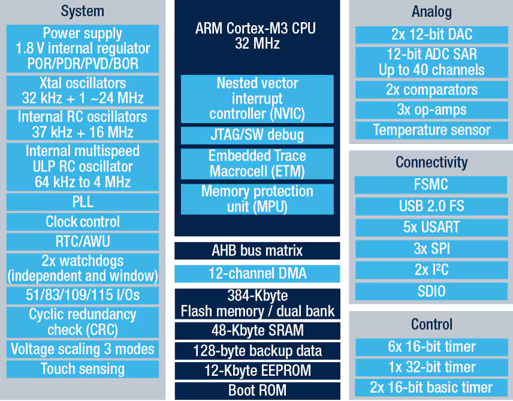
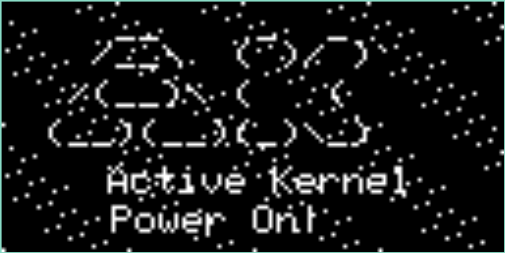
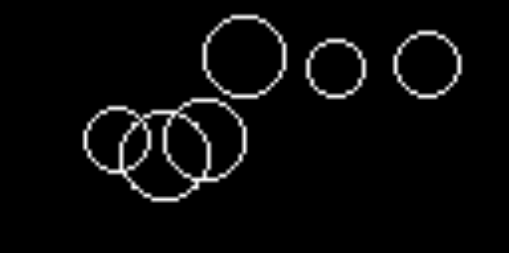
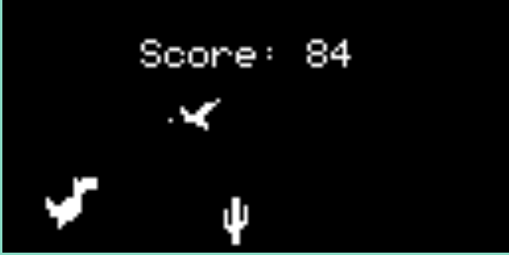
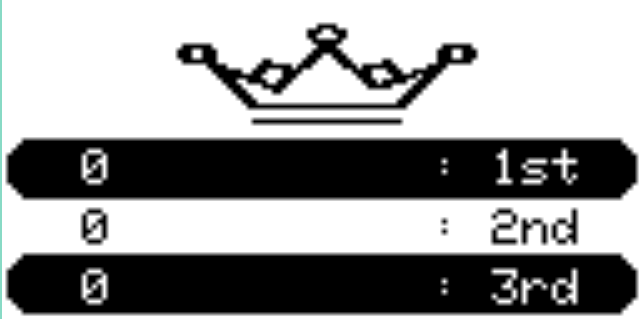
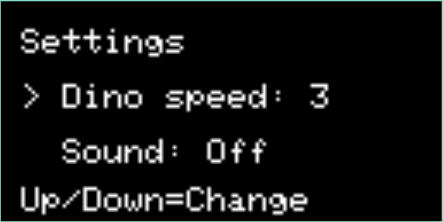

# Ak Base Kit - Dino Game

## Dino Game picture
<table align="center">
  <tr>
    <td>
      
    </td>
  </tr>
</table>
<p align="center"><strong><em>Figure 1:</em></strong> The Dino Game</p>

## Tables of Content
<!--ts-->
  * [Overview](#overview)
  * [Features](#features)
  * [Hardware](#hardware)
  * [Software](#software)
  * [Folder Structure](#folder-structure)
  * [Getting Started](#getting-started)
  * [Programming and Flashing](#programming-and-flashing)
  * [System Overview](#system-overview)
  * [Development](#development)
  * [Troubleshooting](#troubleshooting)
  * [Location](#location)
  * [Liscence](#liscence)
  * [Additional Resources](#additional-resources)
<!--te-->

## Overview

This STM32L151 Ak-Kit project is inspired by the offline dinosaur game (https://trex-runner.com/) developed by Google. In the game, the main character, the dinosaur, must jump or duck to avoid oncoming obstacles such as birds and cacti. The primary goal is to survive as long as possible by skillfully navigating these challenges. Each 100 milliseconds of survival increases your score by 1 point, motivating players to maintain focus and endurance. To keep the game moving, press the UP button to make the dinosaur jump and avoid the obstacles. You can adjust the game speed through the settings menu. Additionally, the sound can be enabled or disabled in the same settings menu, allowing for a customizable gaming experience.

## Features

- **🦖 Jump and Duck Mechanics** – Navigate around obstacles with responsive jump and duck controls to avoid oncoming threats.

- **⏱️ Time-Based Scoring** – Earn points continuously as you survive. Every moment counts toward your final score.

- **🌵 Diverse Obstacle Types** – Battle multiple cactus variants and soaring birds to keep the gameplay fresh and challenging.

- **⚡ Adjustable Game Speed** – Customize difficulty by adjusting obstacle velocity, bird spawn rates, and jump timing to match your skill level.

- **⏲️ Precise Game State Management** – Deterministic timers drive game ticks, obstacle spawning, collision detection, screen transitions, and restart logic for consistent gameplay.

## Hardware
ST state-of-the-art patented technology

<table align="center">
  <tr>
    <td align="center"></td>
  </tr>
</table>
<p align="center"><strong><em>Figure 2:</em></strong> The ARM Cortex-M3</p>
<details>  
    <summary>Ultra-low-power platform</summary>
    
- 1.65 V to 3.6 V power supply
- -40°C to 105°C temperature range
- 305 nA Standby mode (3 wakeup pins)
- 1.15 µA Standby mode + RTC
- 0.475 µA Stop mode (16 wakeup lines)
- 1.35 µA Stop mode + RTC
- 11 µA Low-power run mode
- 230 µA/MHz Run mode
- 10 nA ultra-low I/O leakage
- 8 µs wakeup time
</details> 
<details>   
    <summary>Core: Arm® Cortex®-M3 32-bit CPU</summary>
    
- From 32 kHz up to 32 MHz max
- 33.3 DMIPS peak (Dhrystone 2.1)
- Memory protection unit
- Up to 34 capacitive sensing channels
- CRC calculation unit, 96-bit unique ID
</details>  
<details>
        <summary>Reset and supply management</summary>

- Low-power, ultrasafe BOR (brownout reset) with 5 selectable thresholds
- Ultra-low-power POR/PDR
- Programmable voltage detector (PVD)
</details> 
<details>
        <summary>Clock sources</summary>
        
- 1 to 24 MHz crystal oscillator
- 32 kHz oscillator for RTC with calibration
- High Speed Internal 16 MHz factory-trimmed RC (+/- 1%)
- Internal low-power 37 kHz RC
- Internal multispeed low-power 65 kHz to 4.2 MHz
- PLL for CPU clock and USB (48 MHz)
</details>
<details>
        <summary>Pre-programmed bootloader</summary>
        
- USB and USART supported
- Serial wire debug, JTAG and trace
- Up to 116 fast I/Os (102 I/Os 5V tolerant), all mappable on 16 external interrupt vectors
</details>
<details>
        <summary>Memories</summary>
        
- 384 Kbytes of Flash memory with ECC (with 2 banks of 192 Kbytes enabling Rww capability)
- 48 Kbytes of RAM
- 12 Kbytes of true EEPROM with ECC
- 128-byte backup register
- Memory interface controller supporting SRAM, PSRAM and NOR Flash
- LCD driver (except STM32L151xD devices) up to 8x40 segments, contrast adjustment, blinking mode, step-up converter
</details>
<details>
        <summary>Rich analog peripherals (down to 1.8V)</summary>
        
-  3x operational amplifiers
- 12-bit ADC 1 Msps up to 40 channels
- 12-bit DAC 2 ch with output buffers
- 2x ultra-low-power-comparators(window mode and wakeup capability)
</details>
<details>
        <summary>DMA controller 12x channels</summary>

- 12x peripheral communication interfaces
- 1x USB 2.0 (internal 48 MHz PLL)
- 5x USARTs
- Up to 8x SPIs (2x I2S, 3x 16 Mbit/s)
- 2x I2Cs (SMBus/PMBus)
- 1x SDIO interface
- 11x timers: 1x 32-bit, 6x 16-bit with up to 4 IC/OC/PWM channels, 2x 16-bit basic timers, 2x watchdog timers (independent and window)
</details>


## Software

The software stack is intentionally layered so the game logic stays readable while the low-level
hardware details remain isolated. At a high level, the project is split into four cooperating
layers:

1. **Platform layer** – startup code, board support, GPIO, SPI, timers, and peripheral drivers.
2. **Framework layer** – the lightweight application kernel under `sources/ak/`, which provides
   tasking, finite-state-machine utilities, messaging, and timing primitives.
3. **Common layer** – reusable utilities such as the screen manager, container helpers, command
   parsing, and rendering support.
4. **Game layer** – the Dino gameplay screens, menus, settings, and visual assets.

This separation matters because the game is not a single loop that draws pixels directly. Instead,
the application behaves like a small event-driven system. Input events, timer ticks, screen changes,
and persistence updates flow through the framework and are consumed by dedicated modules. That keeps
the codebase scalable: new screens, new menus, or new gameplay rules can be added without rewriting
the display pipeline or the board drivers.

### Runtime Model

The runtime is built around cooperative responsibilities rather than a monolithic polling loop.
Each module owns one concern and communicates through narrow interfaces:

- **Startup and initialization** prepare clocks, memory, peripherals, display hardware, and board
  services.
- **System tasks** handle background responsibilities such as display refresh, shell handling,
  communication, and lifecycle management.
- **Screen modules** encapsulate the logic for the startup flow, main menu, gameplay, settings,
  charts, idle state, and game-over transitions.
- **Shared state objects** carry game data, configuration, and transient UI state between screens.

This structure creates a clear boundary between *what the game does* and *how the microcontroller
executes it*. The gameplay logic can focus on scoring, obstacle spawning, and player actions, while
the lower layers take care of timing accuracy, frame delivery, and device interaction.

### Screen Architecture

The screen system is the heart of the application. Rather than hard-coding one rendering routine,
the project uses separate screen modules for the different user-facing states. That makes the user
experience feel stateful and deliberate:

- **Startup** initializes the application and presents the entry sequence.
- **Menu** and **settings** screens let the user configure speed and sound before play begins.
- **Dino run** owns the live game state, obstacle progression, collision checks, and score updates.
- **Game over** presents the end state and routes the player back into the flow.
- **Charts / idle** style screens support non-gameplay views and status transitions.

The `screen_manager` layer coordinates transitions, so each screen can stay focused on its own
rendering and behavior logic. That design avoids sprawling `if/else` chains and makes the UI easier
to reason about when the game grows.

### Timing and Responsiveness

Timing is the key technical constraint in a handheld game on a microcontroller. The project uses
timer-driven updates to keep motion, score progression, and animation cadence stable. That has three
important effects:

- **Deterministic gameplay** – obstacle movement and score accumulation happen at a known cadence.
- **Responsive input** – button events can be handled without blocking render logic.
- **Stable animation** – screen updates are synchronized with the application’s internal time base
  instead of depending on ad hoc delays.

This is what makes the game feel consistent on real hardware. The system can miss a frame, but it
does not lose the rules of the game, because the authoritative state lives in the timing and screen
modules rather than in the drawing calls themselves.

### Rendering Pipeline

Rendering is intentionally separated from gameplay decisions. The display driver layer is responsible
for turning screen state into pixels, while the game layer decides *what* should be shown. That means
the logic for cactus placement, dinosaur pose, score counters, and menu selections remains cleanly
isolated from OLED-specific routines.

In practice, this keeps drawing code lightweight and predictable:

- game screens prepare the visual state,
- the common rendering helpers compose the final frame,
- the display driver pushes the result to the panel.

That pipeline is particularly valuable on embedded hardware because it reduces coupling to the
display controller and makes future hardware swaps more practical.

### Persistence and Configuration

The application also treats configuration as part of the software architecture rather than as an
afterthought. Game speed, sound enablement, and other persistent values are stored through the app
data and EEPROM-related modules, which lets the device remember user preferences across resets.

That persistence layer gives the game a more polished feel: the player does not need to reconfigure
basic options every time the board reboots, and the software can restore the last known state cleanly
on startup.

### Why the Design Works

The overall design is deeper than a simple arcade loop because it balances three competing goals at
once:

- **Readability** – each screen and subsystem has a single responsibility.
- **Hardware control** – low-level board access is kept close to the platform layer.
- **Extensibility** – new screens, menus, or gameplay behavior can be added without collapsing the
  architecture.

In short, the software is structured like a small embedded product rather than a demo sketch. That is
what makes it robust: the system can evolve while keeping the gameplay logic, display code, and
hardware drivers properly separated.


## Folder Structure
This is the entire tree structure of this project.

<details>
<summary> Dino Game Project tree structure </summary>

```
akkit-dino-run-game/
├── .clang-format
├── .gitignore
├── application/
│   ├── build.log
│   ├── Makefile
│   ├── sources/
│   │   ├── ak/
│   │   │   ├── ak.cfg.mk
│   │   │   ├── doc/
│   │   │   │   ├── ak_logo.png
│   │   │   │   └── Samek0607.pdf
│   │   │   ├── inc/
│   │   │   │   ├── ak_dbg.h
│   │   │   │   ├── ak.h
│   │   │   │   ├── fsm.h
│   │   │   │   ├── message.h
│   │   │   │   ├── port.h
│   │   │   │   ├── task.h
│   │   │   │   ├── timer.h
│   │   │   │   └── tsm.h
│   │   │   ├── Makefile.mk
│   │   │   └── src/
│   │   │       ├── fsm.c
│   │   │       ├── message.c
│   │   │       ├── task.c
│   │   │       ├── timer.c
│   │   │       └── tsm.c
│   │   ├── app/
│   │   │   ├── app_bsp.cpp
│   │   │   ├── app_bsp.h
│   │   │   ├── app_data.cpp
│   │   │   ├── app_data.h
│   │   │   ├── app_dbg.h
│   │   │   ├── app_eeprom.cpp
│   │   │   ├── app_eeprom.h
│   │   │   ├── app_flash.h
│   │   │   ├── app_if.h
│   │   │   ├── app_non_clear_ram.cpp
│   │   │   ├── app_non_clear_ram.h
│   │   │   ├── app_stubs.cpp
│   │   │   ├── app.cpp
│   │   │   ├── app.h
│   │   │   ├── Makefile.mk
│   │   │   ├── screens/
│   │   │   │   ├── Makefile.mk
│   │   │   │   ├── scr_charts_game.cpp
│   │   │   │   ├── scr_charts_game.h
│   │   │   │   ├── scr_dino_run.cpp
│   │   │   │   ├── scr_dino_run.h
│   │   │   │   ├── scr_game_over.cpp
│   │   │   │   ├── scr_game_over.h
│   │   │   │   ├── scr_game_setting.cpp
│   │   │   │   ├── scr_game_setting.h
│   │   │   │   ├── scr_idle.cpp
│   │   │   │   ├── scr_idle.h
│   │   │   │   ├── scr_menu_game.cpp
│   │   │   │   ├── scr_menu_game.h
│   │   │   │   ├── scr_startup.cpp
│   │   │   │   ├── scr_startup.h
│   │   │   │   ├── screens_bitmap.cpp
│   │   │   │   ├── screens_bitmap.h
│   │   │   │   └── screens.h
│   │   │   ├── shell.cpp
│   │   │   ├── task_display.cpp
│   │   │   ├── task_display.h
│   │   │   ├── task_fw.cpp
│   │   │   ├── task_fw.h
│   │   │   ├── task_if.cpp
│   │   │   ├── task_if.h
│   │   │   ├── task_life.cpp
│   │   │   ├── task_life.h
│   │   │   ├── task_list.cpp
│   │   │   ├── task_list.h
│   │   │   ├── task_shell.cpp
│   │   │   ├── task_shell.h
│   │   │   ├── task_system.cpp
│   │   │   ├── task_system.h
│   │   │   ├── task_uart_if.cpp
│   │   │   └── task_uart_if.h
│   │   ├── common/
│   │   │   ├── cmd_line.c
│   │   │   ├── cmd_line.h
│   │   │   ├── container/
│   │   │   │   ├── fifo.c
│   │   │   │   ├── fifo.h
│   │   │   │   ├── log_queue.c
│   │   │   │   ├── log_queue.h
│   │   │   │   ├── Makefile.mk
│   │   │   │   ├── ring_buffer.c
│   │   │   │   └── ring_buffer.h
│   │   │   ├── Makefile.mk
│   │   │   ├── screen_manager.cpp
│   │   │   ├── screen_manager.h
│   │   │   ├── utils.c
│   │   │   ├── utils.h
│   │   │   ├── view_item.cpp
│   │   │   ├── view_item.h
│   │   │   ├── view_render.cpp
│   │   │   ├── view_render.h
│   │   │   ├── xprintf.c
│   │   │   └── xprintf.h
│   │   ├── driver/
│   │   │   ├── Adafruit_oled_drv/
│   │   │   │   ├── Adafruit_GFX.cpp
│   │   │   │   ├── Adafruit_GFX.h
│   │   │   │   ├── Adafruit_oled_drv.cpp
│   │   │   │   ├── Adafruit_oled_drv.h
│   │   │   │   ├── glcdfont.cpp
│   │   │   │   └── Makefile.mk
│   │   │   ├── AsyncDelay/
│   │   │   │   ├── .bumpversion.cfg
│   │   │   │   ├── examples/
│   │   │   │   │   └── AsyncDelay_example/
│   │   │   │   │       └── AsyncDelay_example.ino
│   │   │   │   ├── keywords.txt
│   │   │   │   ├── library.properties
│   │   │   │   ├── license.txt
│   │   │   │   ├── Makefile.mk
│   │   │   │   ├── readme.md
│   │   │   │   └── src/
│   │   │   │       └── AsyncDelay.h
│   │   │   ├── button/
│   │   │   │   ├── button.c
│   │   │   │   ├── button.h
│   │   │   │   └── Makefile.mk
│   │   │   ├── buzzer/
│   │   │   │   ├── buzzer_music.c
│   │   │   │   ├── buzzer_music.h
│   │   │   │   ├── buzzer.c
│   │   │   │   ├── buzzer.h
│   │   │   │   └── Makefile.mk
│   │   │   ├── eeprom/
│   │   │   │   ├── eeprom.cpp
│   │   │   │   ├── eeprom.h
│   │   │   │   └── Makefile.mk
│   │   │   ├── flash/
│   │   │   │   ├── flash.c
│   │   │   │   ├── flash.h
│   │   │   │   └── Makefile.mk
│   │   │   ├── gpio/
│   │   │   │   ├── gpio_output.c
│   │   │   │   ├── gpio_output.h
│   │   │   │   └── Makefile.mk
│   │   │   ├── led/
│   │   │   │   ├── led.c
│   │   │   │   ├── led.h
│   │   │   │   └── Makefile.mk
│   │   │   └── Makefile.mk
│   │   ├── networks/
│   │   │   ├── Makefile.mk
│   │   │   └── net/
│   │   │       └── link/
│   │   │           ├── hal/
│   │   │           │   ├── link_hal.cpp
│   │   │           │   ├── link_hal.h
│   │   │           │   └── Makefile.mk
│   │   │           ├── link_config.h
│   │   │           ├── link_data.cpp
│   │   │           ├── link_data.h
│   │   │           ├── link_mac.cpp
│   │   │           ├── link_mac.h
│   │   │           ├── link_phy.cpp
│   │   │           ├── link_phy.h
│   │   │           ├── link_sig.h
│   │   │           ├── link.cpp
│   │   │           ├── link.h
│   │   │           └── Makefile.mk
│   │   ├── platform/
│   │   │   └── stm32l/
│   │   │       ├── ak.ld
│   │   │       ├── arduino/
│   │   │       │   ├── cores/
│   │   │       │   │   ├── Arduino.h
│   │   │       │   │   ├── Client.h
│   │   │       │   │   ├── HardwareSerial.cpp
│   │   │       │   │   ├── HardwareSerial.h
│   │   │       │   │   ├── HardwareSerial2.cpp
│   │   │       │   │   ├── IPAddress.cpp
│   │   │       │   │   ├── IPAddress.h
│   │   │       │   │   ├── itoa.cpp
│   │   │       │   │   ├── itoa.h
│   │   │       │   │   ├── Makefile.mk
│   │   │       │   │   ├── Print.cpp
│   │   │       │   │   ├── Print.h
│   │   │       │   │   ├── Printable.h
│   │   │       │   │   ├── Server.h
│   │   │       │   │   ├── stm32/
│   │   │       │   │   │   ├── dtostrf.c
│   │   │       │   │   │   ├── dtostrf.h
│   │   │       │   │   │   ├── hooks.c
│   │   │       │   │   │   ├── Makefile.mk
│   │   │       │   │   │   └── pgmspace.h
│   │   │       │   │   ├── Stream.cpp
│   │   │       │   │   ├── Stream.h
│   │   │       │   │   ├── Udp.h
│   │   │       │   │   ├── WCharacter.h
│   │   │       │   │   ├── wiring_digital.cpp
│   │   │       │   │   ├── wiring_shift.cpp
│   │   │       │   │   ├── WMath.cpp
│   │   │       │   │   ├── WString.cpp
│   │   │       │   │   └── WString.h
│   │   │       │   ├── libraries/
│   │   │       │   │   ├── Makefile.mk
│   │   │       │   │   ├── SPI/
│   │   │       │   │   │   ├── Makefile.mk
│   │   │       │   │   │   ├── SPI.cpp
│   │   │       │   │   │   └── SPI.h
│   │   │       │   │   └── Wire/
│   │   │       │   │       ├── Makefile.mk
│   │   │       │   │       ├── utility/
│   │   │       │   │       │   ├── twi.cpp
│   │   │       │   │       │   └── twi.h
│   │   │       │   │       ├── Wire.cpp
│   │   │       │   │       └── Wire.h
│   │   │       │   └── Makefile.mk
│   │   │       ├── doc/
│   │   │       │   ├── ARM_Cortex_AppNote179.pdf
│   │   │       │   ├── datasheet.pdf
│   │   │       │   ├── HAL.pdf
│   │   │       │   ├── ProgrammingManual.pdf
│   │   │       │   └── ReferenceManual.pdf
│   │   │       ├── io_cfg.c
│   │   │       ├── io_cfg.h
│   │   │       ├── Libraries/
│   │   │       │   ├── CMSIS/
│   │   │       │   │   ├── CMSIS END USER LICENCE AGREEMENT.pdf
│   │   │       │   │   ├── Device/
│   │   │       │   │   │   └── ST/
│   │   │       │   │   │       └── STM32L1xx/
│   │   │       │   │   │           ├── Include/
│   │   │       │   │   │           │   ├── stm32l1xx.h
│   │   │       │   │   │           │   └── system_stm32l1xx.h
│   │   │       │   │   │           ├── Release_Notes.html
│   │   │       │   │   │           └── Source/
│   │   │       │   │   │               └── Templates/
│   │   │       │   │   │                   ├── arm/
│   │   │       │   │   │                   │   ├── startup_stm32l1xx_hd.s
│   │   │       │   │   │                   │   ├── startup_stm32l1xx_md.s
│   │   │       │   │   │                   │   ├── startup_stm32l1xx_mdp.s
│   │   │       │   │   │                   │   └── startup_stm32l1xx_xl.s
│   │   │       │   │   │                   ├── gcc_ride7/
│   │   │       │   │   │                   │   ├── startup_stm32l1xx_hd.s
│   │   │       │   │   │                   │   ├── startup_stm32l1xx_md.s
│   │   │       │   │   │                   │   ├── startup_stm32l1xx_mdp.s
│   │   │       │   │   │                   │   └── startup_stm32l1xx_xl.s
│   │   │       │   │   │                   ├── iar/
│   │   │       │   │   │                   │   ├── startup_stm32l1xx_hd.s
│   │   │       │   │   │                   │   ├── startup_stm32l1xx_md.s
│   │   │       │   │   │                   │   ├── startup_stm32l1xx_mdp.s
│   │   │       │   │   │                   │   └── startup_stm32l1xx_xl.s
│   │   │       │   │   │                   ├── system_stm32l1xx.c
│   │   │       │   │   │                   ├── TASKING/
│   │   │       │   │   │                   │   └── cstart_thumb2.asm
│   │   │       │   │   │                   └── TrueSTUDIO/
│   │   │       │   │   │                       ├── startup_stm32l1xx_hd.s
│   │   │       │   │   │                       ├── startup_stm32l1xx_md.s
│   │   │       │   │   │                       ├── startup_stm32l1xx_mdp.s
│   │   │       │   │   │                       └── startup_stm32l1xx_xl.s
│   │   │       │   │   ├── Documentation/
│   │   │       │   │   │   ├── Core/
│   │   │       │   │   │   │   └── html/
│   │   │       │   │   │   │       ├── _c_o_r_e__m_i_s_r_a__exceptions_pg.html
│   │   │       │   │   │   │       ├── _reg_map_pg.html
│   │   │       │   │   │   │       ├── _templates_pg.html
│   │   │       │   │   │   │       ├── _templates_pg.js
│   │   │       │   │   │   │       ├── _using__a_r_m_pg.html
│   │   │       │   │   │   │       ├── _using_pg.html
│   │   │       │   │   │   │       ├── _using_pg.js
│   │   │       │   │   │   │       ├── annotated.html
│   │   │       │   │   │   │       ├── annotated.js
│   │   │       │   │   │   │       ├── bc_s.png
│   │   │       │   │   │   │       ├── bdwn.png
│   │   │       │   │   │   │       ├── check.png
│   │   │       │   │   │   │       ├── classes.html
│   │   │       │   │   │   │       ├── closed.png
│   │   │       │   │   │   │       ├── CMSIS_CORE_Files_user.png
│   │   │       │   │   │   │       ├── CMSIS_CORE_Files.png
│   │   │       │   │   │   │       ├── CMSIS_Logo_Final.png
│   │   │       │   │   │   │       ├── cmsis.css
│   │   │       │   │   │   │       ├── device_h_pg.html
│   │   │       │   │   │   │       ├── doxygen.png
│   │   │       │   │   │   │       ├── dynsections.js
│   │   │       │   │   │   │       ├── ftv2blank.png
│   │   │       │   │   │   │       ├── ftv2cl.png
│   │   │       │   │   │   │       ├── ftv2doc.png
│   │   │       │   │   │   │       ├── ftv2folderclosed.png
│   │   │       │   │   │   │       ├── ftv2folderopen.png
│   │   │       │   │   │   │       ├── ftv2lastnode.png
│   │   │       │   │   │   │       ├── ftv2link.png
│   │   │       │   │   │   │       ├── ftv2mlastnode.png
│   │   │       │   │   │   │       ├── ftv2mnode.png
│   │   │       │   │   │   │       ├── ftv2mo.png
│   │   │       │   │   │   │       ├── ftv2node.png
│   │   │       │   │   │   │       ├── ftv2ns.png
│   │   │       │   │   │   │       ├── ftv2plastnode.png
│   │   │       │   │   │   │       ├── ftv2pnode.png
│   │   │       │   │   │   │       ├── ftv2splitbar.png
│   │   │       │   │   │   │       ├── ftv2vertline.png
│   │   │       │   │   │   │       ├── functions_vars.html
│   │   │       │   │   │   │       ├── functions.html
│   │   │       │   │   │   │       ├── globals_enum.html
│   │   │       │   │   │   │       ├── globals_eval.html
│   │   │       │   │   │   │       ├── globals_func.html
│   │   │       │   │   │   │       ├── globals_vars.html
│   │   │       │   │   │   │       ├── globals.html
│   │   │       │   │   │   │       ├── group___core___register__gr.html
│   │   │       │   │   │   │       ├── group___core___register__gr.js
│   │   │       │   │   │   │       ├── group___i_t_m___debug__gr.html
│   │   │       │   │   │   │       ├── group___i_t_m___debug__gr.js
│   │   │       │   │   │   │       ├── group___n_v_i_c__gr.html
│   │   │       │   │   │   │       ├── group___n_v_i_c__gr.js
│   │   │       │   │   │   │       ├── group___sys_tick__gr.html
│   │   │       │   │   │   │       ├── group___sys_tick__gr.js
│   │   │       │   │   │   │       ├── group__intrinsic___c_p_u__gr.html
│   │   │       │   │   │   │       ├── group__intrinsic___c_p_u__gr.js
│   │   │       │   │   │   │       ├── group__intrinsic___s_i_m_d__gr.html
│   │   │       │   │   │   │       ├── group__intrinsic___s_i_m_d__gr.js
│   │   │       │   │   │   │       ├── group__peripheral__gr.html
│   │   │       │   │   │   │       ├── group__system__init__gr.html
│   │   │       │   │   │   │       ├── group__system__init__gr.js
│   │   │       │   │   │   │       ├── index.html
│   │   │       │   │   │   │       ├── jquery.js
│   │   │       │   │   │   │       ├── modules.html
│   │   │       │   │   │   │       ├── modules.js
│   │   │       │   │   │   │       ├── nav_f.png
│   │   │       │   │   │   │       ├── nav_g.png
│   │   │       │   │   │   │       ├── nav_h.png
│   │   │       │   │   │   │       ├── navtree.css
│   │   │       │   │   │   │       ├── navtree.js
│   │   │       │   │   │   │       ├── navtreeindex0.js
│   │   │       │   │   │   │       ├── navtreeindex1.js
│   │   │       │   │   │   │       ├── open.png
│   │   │       │   │   │   │       ├── pages.html
│   │   │       │   │   │   │       ├── resize.js
│   │   │       │   │   │   │       ├── search/
│   │   │       │   │   │   │       │   ├── all_5f.html
│   │   │       │   │   │   │       │   ├── all_5f.js
│   │   │       │   │   │   │       │   ├── all_61.html
│   │   │       │   │   │   │       │   ├── all_61.js
│   │   │       │   │   │   │       │   ├── all_62.html
│   │   │       │   │   │   │       │   ├── all_62.js
│   │   │       │   │   │   │       │   ├── all_63.html
│   │   │       │   │   │   │       │   ├── all_63.js
│   │   │       │   │   │   │       │   ├── all_64.html
│   │   │       │   │   │   │       │   ├── all_64.js
│   │   │       │   │   │   │       │   ├── all_65.html
│   │   │       │   │   │   │       │   ├── all_65.js
│   │   │       │   │   │   │       │   ├── all_66.html
│   │   │       │   │   │   │       │   ├── all_66.js
│   │   │       │   │   │   │       │   ├── all_68.html
│   │   │       │   │   │   │       │   ├── all_68.js
│   │   │       │   │   │   │       │   ├── all_69.html
│   │   │       │   │   │   │       │   ├── all_69.js
│   │   │       │   │   │   │       │   ├── all_6c.html
│   │   │       │   │   │   │       │   ├── all_6c.js
│   │   │       │   │   │   │       │   ├── all_6d.html
│   │   │       │   │   │   │       │   ├── all_6d.js
│   │   │       │   │   │   │       │   ├── all_6e.html
│   │   │       │   │   │   │       │   ├── all_6e.js
│   │   │       │   │   │   │       │   ├── all_6f.html
│   │   │       │   │   │   │       │   ├── all_6f.js
│   │   │       │   │   │   │       │   ├── all_70.html
│   │   │       │   │   │   │       │   ├── all_70.js
│   │   │       │   │   │   │       │   ├── all_71.html
│   │   │       │   │   │   │       │   ├── all_71.js
│   │   │       │   │   │   │       │   ├── all_72.html
│   │   │       │   │   │   │       │   ├── all_72.js
│   │   │       │   │   │   │       │   ├── all_73.html
│   │   │       │   │   │   │       │   ├── all_73.js
│   │   │       │   │   │   │       │   ├── all_74.html
│   │   │       │   │   │   │       │   ├── all_74.js
│   │   │       │   │   │   │       │   ├── all_75.html
│   │   │       │   │   │   │       │   ├── all_75.js
│   │   │       │   │   │   │       │   ├── all_76.html
│   │   │       │   │   │   │       │   ├── all_76.js
│   │   │       │   │   │   │       │   ├── all_77.html
│   │   │       │   │   │   │       │   ├── all_77.js
│   │   │       │   │   │   │       │   ├── all_78.html
│   │   │       │   │   │   │       │   ├── all_78.js
│   │   │       │   │   │   │       │   ├── all_7a.html
│   │   │       │   │   │   │       │   ├── all_7a.js
│   │   │       │   │   │   │       │   ├── classes_61.html
│   │   │       │   │   │   │       │   ├── classes_61.js
│   │   │       │   │   │   │       │   ├── classes_63.html
│   │   │       │   │   │   │       │   ├── classes_63.js
│   │   │       │   │   │   │       │   ├── classes_64.html
│   │   │       │   │   │   │       │   ├── classes_64.js
│   │   │       │   │   │   │       │   ├── classes_66.html
│   │   │       │   │   │   │       │   ├── classes_66.js
│   │   │       │   │   │   │       │   ├── classes_69.html
│   │   │       │   │   │   │       │   ├── classes_69.js
│   │   │       │   │   │   │       │   ├── classes_6d.html
│   │   │       │   │   │   │       │   ├── classes_6d.js
│   │   │       │   │   │   │       │   ├── classes_6e.html
│   │   │       │   │   │   │       │   ├── classes_6e.js
│   │   │       │   │   │   │       │   ├── classes_73.html
│   │   │       │   │   │   │       │   ├── classes_73.js
│   │   │       │   │   │   │       │   ├── classes_74.html
│   │   │       │   │   │   │       │   ├── classes_74.js
│   │   │       │   │   │   │       │   ├── classes_78.html
│   │   │       │   │   │   │       │   ├── classes_78.js
│   │   │       │   │   │   │       │   ├── close.png
│   │   │       │   │   │   │       │   ├── enums_69.html
│   │   │       │   │   │   │       │   ├── enums_69.js
│   │   │       │   │   │   │       │   ├── enumvalues_62.html
│   │   │       │   │   │   │       │   ├── enumvalues_62.js
│   │   │       │   │   │   │       │   ├── enumvalues_64.html
│   │   │       │   │   │   │       │   ├── enumvalues_64.js
│   │   │       │   │   │   │       │   ├── enumvalues_68.html
│   │   │       │   │   │   │       │   ├── enumvalues_68.js
│   │   │       │   │   │   │       │   ├── enumvalues_6d.html
│   │   │       │   │   │   │       │   ├── enumvalues_6d.js
│   │   │       │   │   │   │       │   ├── enumvalues_6e.html
│   │   │       │   │   │   │       │   ├── enumvalues_6e.js
│   │   │       │   │   │   │       │   ├── enumvalues_70.html
│   │   │       │   │   │   │       │   ├── enumvalues_70.js
│   │   │       │   │   │   │       │   ├── enumvalues_73.html
│   │   │       │   │   │   │       │   ├── enumvalues_73.js
│   │   │       │   │   │   │       │   ├── enumvalues_75.html
│   │   │       │   │   │   │       │   ├── enumvalues_75.js
│   │   │       │   │   │   │       │   ├── enumvalues_77.html
│   │   │       │   │   │   │       │   ├── enumvalues_77.js
│   │   │       │   │   │   │       │   ├── files_6d.html
│   │   │       │   │   │   │       │   ├── files_6d.js
│   │   │       │   │   │   │       │   ├── files_6f.html
│   │   │       │   │   │   │       │   ├── files_6f.js
│   │   │       │   │   │   │       │   ├── files_72.html
│   │   │       │   │   │   │       │   ├── files_72.js
│   │   │       │   │   │   │       │   ├── files_74.html
│   │   │       │   │   │   │       │   ├── files_74.js
│   │   │       │   │   │   │       │   ├── files_75.html
│   │   │       │   │   │   │       │   ├── files_75.js
│   │   │       │   │   │   │       │   ├── functions_5f.html
│   │   │       │   │   │   │       │   ├── functions_5f.js
│   │   │       │   │   │   │       │   ├── functions_69.html
│   │   │       │   │   │   │       │   ├── functions_69.js
│   │   │       │   │   │   │       │   ├── functions_6e.html
│   │   │       │   │   │   │       │   ├── functions_6e.js
│   │   │       │   │   │   │       │   ├── functions_73.html
│   │   │       │   │   │   │       │   ├── functions_73.js
│   │   │       │   │   │   │       │   ├── groups_63.html
│   │   │       │   │   │   │       │   ├── groups_63.js
│   │   │       │   │   │   │       │   ├── groups_64.html
│   │   │       │   │   │   │       │   ├── groups_64.js
│   │   │       │   │   │   │       │   ├── groups_69.html
│   │   │       │   │   │   │       │   ├── groups_69.js
│   │   │       │   │   │   │       │   ├── groups_70.html
│   │   │       │   │   │   │       │   ├── groups_70.js
│   │   │       │   │   │   │       │   ├── groups_73.html
│   │   │       │   │   │   │       │   ├── groups_73.js
│   │   │       │   │   │   │       │   ├── mag_sel.png
│   │   │       │   │   │   │       │   ├── nomatches.html
│   │   │       │   │   │   │       │   ├── pages_64.html
│   │   │       │   │   │   │       │   ├── pages_64.js
│   │   │       │   │   │   │       │   ├── pages_6d.html
│   │   │       │   │   │   │       │   ├── pages_6d.js
│   │   │       │   │   │   │       │   ├── pages_6f.html
│   │   │       │   │   │   │       │   ├── pages_6f.js
│   │   │       │   │   │   │       │   ├── pages_72.html
│   │   │       │   │   │   │       │   ├── pages_72.js
│   │   │       │   │   │   │       │   ├── pages_73.html
│   │   │       │   │   │   │       │   ├── pages_73.js
│   │   │       │   │   │   │       │   ├── pages_74.html
│   │   │       │   │   │   │       │   ├── pages_74.js
│   │   │       │   │   │   │       │   ├── pages_75.html
│   │   │       │   │   │   │       │   ├── pages_75.js
│   │   │       │   │   │   │       │   ├── search_l.png
│   │   │       │   │   │   │       │   ├── search_m.png
│   │   │       │   │   │   │       │   ├── search_r.png
│   │   │       │   │   │   │       │   ├── search.css
│   │   │       │   │   │   │       │   ├── search.js
│   │   │       │   │   │   │       │   ├── variables_5f.html
│   │   │       │   │   │   │       │   ├── variables_5f.js
│   │   │       │   │   │   │       │   ├── variables_61.html
│   │   │       │   │   │   │       │   ├── variables_61.js
│   │   │       │   │   │   │       │   ├── variables_62.html
│   │   │       │   │   │   │       │   ├── variables_62.js
│   │   │       │   │   │   │       │   ├── variables_63.html
│   │   │       │   │   │   │       │   ├── variables_63.js
│   │   │       │   │   │   │       │   ├── variables_64.html
│   │   │       │   │   │   │       │   ├── variables_64.js
│   │   │       │   │   │   │       │   ├── variables_65.html
│   │   │       │   │   │   │       │   ├── variables_65.js
│   │   │       │   │   │   │       │   ├── variables_66.html
│   │   │       │   │   │   │       │   ├── variables_66.js
│   │   │       │   │   │   │       │   ├── variables_68.html
│   │   │       │   │   │   │       │   ├── variables_68.js
│   │   │       │   │   │   │       │   ├── variables_69.html
│   │   │       │   │   │   │       │   ├── variables_69.js
│   │   │       │   │   │   │       │   ├── variables_6c.html
│   │   │       │   │   │   │       │   ├── variables_6c.js
│   │   │       │   │   │   │       │   ├── variables_6d.html
│   │   │       │   │   │   │       │   ├── variables_6d.js
│   │   │       │   │   │   │       │   ├── variables_6e.html
│   │   │       │   │   │   │       │   ├── variables_6e.js
│   │   │       │   │   │   │       │   ├── variables_70.html
│   │   │       │   │   │   │       │   ├── variables_70.js
│   │   │       │   │   │   │       │   ├── variables_71.html
│   │   │       │   │   │   │       │   ├── variables_71.js
│   │   │       │   │   │   │       │   ├── variables_72.html
│   │   │       │   │   │   │       │   ├── variables_72.js
│   │   │       │   │   │   │       │   ├── variables_73.html
│   │   │       │   │   │   │       │   ├── variables_73.js
│   │   │       │   │   │   │       │   ├── variables_74.html
│   │   │       │   │   │   │       │   ├── variables_74.js
│   │   │       │   │   │   │       │   ├── variables_75.html
│   │   │       │   │   │   │       │   ├── variables_75.js
│   │   │       │   │   │   │       │   ├── variables_76.html
│   │   │       │   │   │   │       │   ├── variables_76.js
│   │   │       │   │   │   │       │   ├── variables_77.html
│   │   │       │   │   │   │       │   ├── variables_77.js
│   │   │       │   │   │   │       │   ├── variables_7a.html
│   │   │       │   │   │   │       │   └── variables_7a.js
│   │   │       │   │   │   │       ├── search.css
│   │   │       │   │   │   │       ├── startup_s_pg.html
│   │   │       │   │   │   │       ├── struct_core_debug___type.html
│   │   │       │   │   │   │       ├── struct_core_debug___type.js
│   │   │       │   │   │   │       ├── struct_d_w_t___type.html
│   │   │       │   │   │   │       ├── struct_d_w_t___type.js
│   │   │       │   │   │   │       ├── struct_f_p_u___type.html
│   │   │       │   │   │   │       ├── struct_f_p_u___type.js
│   │   │       │   │   │   │       ├── struct_i_t_m___type.html
│   │   │       │   │   │   │       ├── struct_i_t_m___type.js
│   │   │       │   │   │   │       ├── struct_m_p_u___type.html
│   │   │       │   │   │   │       ├── struct_m_p_u___type.js
│   │   │       │   │   │   │       ├── struct_n_v_i_c___type.html
│   │   │       │   │   │   │       ├── struct_n_v_i_c___type.js
│   │   │       │   │   │   │       ├── struct_s_c_b___type.html
│   │   │       │   │   │   │       ├── struct_s_c_b___type.js
│   │   │       │   │   │   │       ├── struct_s_cn_s_c_b___type.html
│   │   │       │   │   │   │       ├── struct_s_cn_s_c_b___type.js
│   │   │       │   │   │   │       ├── struct_sys_tick___type.html
│   │   │       │   │   │   │       ├── struct_sys_tick___type.js
│   │   │       │   │   │   │       ├── struct_t_p_i___type.html
│   │   │       │   │   │   │       ├── struct_t_p_i___type.js
│   │   │       │   │   │   │       ├── sync_off.png
│   │   │       │   │   │   │       ├── sync_on.png
│   │   │       │   │   │   │       ├── system_c_pg.html
│   │   │       │   │   │   │       ├── tab_a.png
│   │   │       │   │   │   │       ├── tab_b.png
│   │   │       │   │   │   │       ├── tab_h.png
│   │   │       │   │   │   │       ├── tab_s.png
│   │   │       │   │   │   │       ├── tab_topnav.png
│   │   │       │   │   │   │       ├── tabs.css
│   │   │       │   │   │   │       ├── union_a_p_s_r___type.html
│   │   │       │   │   │   │       ├── union_a_p_s_r___type.js
│   │   │       │   │   │   │       ├── union_c_o_n_t_r_o_l___type.html
│   │   │       │   │   │   │       ├── union_c_o_n_t_r_o_l___type.js
│   │   │       │   │   │   │       ├── union_i_p_s_r___type.html
│   │   │       │   │   │   │       ├── union_i_p_s_r___type.js
│   │   │       │   │   │   │       ├── unionx_p_s_r___type.html
│   │   │       │   │   │   │       └── unionx_p_s_r___type.js
│   │   │       │   │   │   ├── General/
│   │   │       │   │   │   │   └── html/
│   │   │       │   │   │   │       ├── bc_s.png
│   │   │       │   │   │   │       ├── bdwn.png
│   │   │       │   │   │   │       ├── closed.png
│   │   │       │   │   │   │       ├── CMSIS_Logo_Final.png
│   │   │       │   │   │   │       ├── CMSIS_V3_small.png
│   │   │       │   │   │   │       ├── cmsis.css
│   │   │       │   │   │   │       ├── doxygen.png
│   │   │       │   │   │   │       ├── dynsections.js
│   │   │       │   │   │   │       ├── ftv2blank.png
│   │   │       │   │   │   │       ├── ftv2cl.png
│   │   │       │   │   │   │       ├── ftv2doc.png
│   │   │       │   │   │   │       ├── ftv2folderclosed.png
│   │   │       │   │   │   │       ├── ftv2folderopen.png
│   │   │       │   │   │   │       ├── ftv2lastnode.png
│   │   │       │   │   │   │       ├── ftv2link.png
│   │   │       │   │   │   │       ├── ftv2mlastnode.png
│   │   │       │   │   │   │       ├── ftv2mnode.png
│   │   │       │   │   │   │       ├── ftv2mo.png
│   │   │       │   │   │   │       ├── ftv2node.png
│   │   │       │   │   │   │       ├── ftv2ns.png
│   │   │       │   │   │   │       ├── ftv2plastnode.png
│   │   │       │   │   │   │       ├── ftv2pnode.png
│   │   │       │   │   │   │       ├── ftv2splitbar.png
│   │   │       │   │   │   │       ├── ftv2vertline.png
│   │   │       │   │   │   │       ├── index.html
│   │   │       │   │   │   │       ├── jquery.js
│   │   │       │   │   │   │       ├── nav_f.png
│   │   │       │   │   │   │       ├── nav_g.png
│   │   │       │   │   │   │       ├── nav_h.png
│   │   │       │   │   │   │       ├── navtree.css
│   │   │       │   │   │   │       ├── navtree.js
│   │   │       │   │   │   │       ├── navtreeindex0.js
│   │   │       │   │   │   │       ├── open.png
│   │   │       │   │   │   │       ├── resize.js
│   │   │       │   │   │   │       ├── sync_off.png
│   │   │       │   │   │   │       ├── sync_on.png
│   │   │       │   │   │   │       ├── tab_a.png
│   │   │       │   │   │   │       ├── tab_b.png
│   │   │       │   │   │   │       ├── tab_h.png
│   │   │       │   │   │   │       ├── tab_s.png
│   │   │       │   │   │   │       ├── tab_topnav.png
│   │   │       │   │   │   │       └── tabs.css
│   │   │       │   │   │   ├── RTOS/
│   │   │       │   │   │   │   └── html/
│   │   │       │   │   │   │       ├── _function_overview.html
│   │   │       │   │   │   │       ├── _using_o_s.html
│   │   │       │   │   │   │       ├── annotated.html
│   │   │       │   │   │   │       ├── annotated.js
│   │   │       │   │   │   │       ├── API_Structure.png
│   │   │       │   │   │   │       ├── bc_s.png
│   │   │       │   │   │   │       ├── bdwn.png
│   │   │       │   │   │   │       ├── classes.html
│   │   │       │   │   │   │       ├── closed.png
│   │   │       │   │   │   │       ├── cmsis__os_8h.html
│   │   │       │   │   │   │       ├── cmsis__os_8txt.html
│   │   │       │   │   │   │       ├── CMSIS_Logo_Final.png
│   │   │       │   │   │   │       ├── cmsis_os_h.html
│   │   │       │   │   │   │       ├── CMSIS_RTOS_Files.png
│   │   │       │   │   │   │       ├── cmsis.css
│   │   │       │   │   │   │       ├── dir_67baed4ff719a838d401a6dc7774cf41.html
│   │   │       │   │   │   │       ├── dir_9afdeffb8e409a4e0df5c5bf9ab1a7d2.html
│   │   │       │   │   │   │       ├── doxygen.png
│   │   │       │   │   │   │       ├── dynsections.js
│   │   │       │   │   │   │       ├── files.html
│   │   │       │   │   │   │       ├── ftv2blank.png
│   │   │       │   │   │   │       ├── ftv2cl.png
│   │   │       │   │   │   │       ├── ftv2doc.png
│   │   │       │   │   │   │       ├── ftv2folderclosed.png
│   │   │       │   │   │   │       ├── ftv2folderopen.png
│   │   │       │   │   │   │       ├── ftv2lastnode.png
│   │   │       │   │   │   │       ├── ftv2link.png
│   │   │       │   │   │   │       ├── ftv2mlastnode.png
│   │   │       │   │   │   │       ├── ftv2mnode.png
│   │   │       │   │   │   │       ├── ftv2mo.png
│   │   │       │   │   │   │       ├── ftv2node.png
│   │   │       │   │   │   │       ├── ftv2ns.png
│   │   │       │   │   │   │       ├── ftv2plastnode.png
│   │   │       │   │   │   │       ├── ftv2pnode.png
│   │   │       │   │   │   │       ├── ftv2splitbar.png
│   │   │       │   │   │   │       ├── ftv2vertline.png
│   │   │       │   │   │   │       ├── functions_vars.html
│   │   │       │   │   │   │       ├── functions.html
│   │   │       │   │   │   │       ├── globals_defs.html
│   │   │       │   │   │   │       ├── globals_enum.html
│   │   │       │   │   │   │       ├── globals_eval.html
│   │   │       │   │   │   │       ├── globals_func.html
│   │   │       │   │   │   │       ├── globals_type.html
│   │   │       │   │   │   │       ├── globals.html
│   │   │       │   │   │   │       ├── group___c_m_s_i_s___r_t_o_s___definitions.html
│   │   │       │   │   │   │       ├── group___c_m_s_i_s___r_t_o_s___definitions.js
│   │   │       │   │   │   │       ├── group___c_m_s_i_s___r_t_o_s___kernel_ctrl.html
│   │   │       │   │   │   │       ├── group___c_m_s_i_s___r_t_o_s___kernel_ctrl.js
│   │   │       │   │   │   │       ├── group___c_m_s_i_s___r_t_o_s___mail.html
│   │   │       │   │   │   │       ├── group___c_m_s_i_s___r_t_o_s___mail.js
│   │   │       │   │   │   │       ├── group___c_m_s_i_s___r_t_o_s___message.html
│   │   │       │   │   │   │       ├── group___c_m_s_i_s___r_t_o_s___message.js
│   │   │       │   │   │   │       ├── group___c_m_s_i_s___r_t_o_s___mutex_mgmt.html
│   │   │       │   │   │   │       ├── group___c_m_s_i_s___r_t_o_s___mutex_mgmt.js
│   │   │       │   │   │   │       ├── group___c_m_s_i_s___r_t_o_s___pool_mgmt.html
│   │   │       │   │   │   │       ├── group___c_m_s_i_s___r_t_o_s___pool_mgmt.js
│   │   │       │   │   │   │       ├── group___c_m_s_i_s___r_t_o_s___semaphore_mgmt.html
│   │   │       │   │   │   │       ├── group___c_m_s_i_s___r_t_o_s___semaphore_mgmt.js
│   │   │       │   │   │   │       ├── group___c_m_s_i_s___r_t_o_s___signal_mgmt.html
│   │   │       │   │   │   │       ├── group___c_m_s_i_s___r_t_o_s___signal_mgmt.js
│   │   │       │   │   │   │       ├── group___c_m_s_i_s___r_t_o_s___status.html
│   │   │       │   │   │   │       ├── group___c_m_s_i_s___r_t_o_s___status.js
│   │   │       │   │   │   │       ├── group___c_m_s_i_s___r_t_o_s___thread_mgmt.html
│   │   │       │   │   │   │       ├── group___c_m_s_i_s___r_t_o_s___thread_mgmt.js
│   │   │       │   │   │   │       ├── group___c_m_s_i_s___r_t_o_s___timer_mgmt.html
│   │   │       │   │   │   │       ├── group___c_m_s_i_s___r_t_o_s___timer_mgmt.js
│   │   │       │   │   │   │       ├── group___c_m_s_i_s___r_t_o_s___wait.html
│   │   │       │   │   │   │       ├── group___c_m_s_i_s___r_t_o_s___wait.js
│   │   │       │   │   │   │       ├── group___c_m_s_i_s___r_t_o_s.html
│   │   │       │   │   │   │       ├── group___c_m_s_i_s___r_t_o_s.js
│   │   │       │   │   │   │       ├── index.html
│   │   │       │   │   │   │       ├── jquery.js
│   │   │       │   │   │   │       ├── MailQueue.png
│   │   │       │   │   │   │       ├── MessageQueue.png
│   │   │       │   │   │   │       ├── modules.html
│   │   │       │   │   │   │       ├── modules.js
│   │   │       │   │   │   │       ├── Mutex.png
│   │   │       │   │   │   │       ├── nav_f.png
│   │   │       │   │   │   │       ├── nav_g.png
│   │   │       │   │   │   │       ├── nav_h.png
│   │   │       │   │   │   │       ├── navtree.css
│   │   │       │   │   │   │       ├── navtree.js
│   │   │       │   │   │   │       ├── navtreeindex0.js
│   │   │       │   │   │   │       ├── open.png
│   │   │       │   │   │   │       ├── pages.html
│   │   │       │   │   │   │       ├── resize.js
│   │   │       │   │   │   │       ├── search/
│   │   │       │   │   │   │       │   ├── all_63.html
│   │   │       │   │   │   │       │   ├── all_63.js
│   │   │       │   │   │   │       │   ├── all_64.html
│   │   │       │   │   │   │       │   ├── all_64.js
│   │   │       │   │   │   │       │   ├── all_66.html
│   │   │       │   │   │   │       │   ├── all_66.js
│   │   │       │   │   │   │       │   ├── all_67.html
│   │   │       │   │   │   │       │   ├── all_67.js
│   │   │       │   │   │   │       │   ├── all_68.html
│   │   │       │   │   │   │       │   ├── all_68.js
│   │   │       │   │   │   │       │   ├── all_69.html
│   │   │       │   │   │   │       │   ├── all_69.js
│   │   │       │   │   │   │       │   ├── all_6b.html
│   │   │       │   │   │   │       │   ├── all_6b.js
│   │   │       │   │   │   │       │   ├── all_6d.html
│   │   │       │   │   │   │       │   ├── all_6d.js
│   │   │       │   │   │   │       │   ├── all_6f.html
│   │   │       │   │   │   │       │   ├── all_6f.js
│   │   │       │   │   │   │       │   ├── all_70.html
│   │   │       │   │   │   │       │   ├── all_70.js
│   │   │       │   │   │   │       │   ├── all_71.html
│   │   │       │   │   │   │       │   ├── all_71.js
│   │   │       │   │   │   │       │   ├── all_73.html
│   │   │       │   │   │   │       │   ├── all_73.js
│   │   │       │   │   │   │       │   ├── all_74.html
│   │   │       │   │   │   │       │   ├── all_74.js
│   │   │       │   │   │   │       │   ├── all_75.html
│   │   │       │   │   │   │       │   ├── all_75.js
│   │   │       │   │   │   │       │   ├── all_76.html
│   │   │       │   │   │   │       │   ├── all_76.js
│   │   │       │   │   │   │       │   ├── classes_6f.html
│   │   │       │   │   │   │       │   ├── classes_6f.js
│   │   │       │   │   │   │       │   ├── close.png
│   │   │       │   │   │   │       │   ├── defines_6f.html
│   │   │       │   │   │   │       │   ├── defines_6f.js
│   │   │       │   │   │   │       │   ├── enums_6f.html
│   │   │       │   │   │   │       │   ├── enums_6f.js
│   │   │       │   │   │   │       │   ├── enumvalues_6f.html
│   │   │       │   │   │   │       │   ├── enumvalues_6f.js
│   │   │       │   │   │   │       │   ├── files_63.html
│   │   │       │   │   │   │       │   ├── files_63.js
│   │   │       │   │   │   │       │   ├── functions_6f.html
│   │   │       │   │   │   │       │   ├── functions_6f.js
│   │   │       │   │   │   │       │   ├── groups_63.html
│   │   │       │   │   │   │       │   ├── groups_63.js
│   │   │       │   │   │   │       │   ├── groups_67.html
│   │   │       │   │   │   │       │   ├── groups_67.js
│   │   │       │   │   │   │       │   ├── groups_6b.html
│   │   │       │   │   │   │       │   ├── groups_6b.js
│   │   │       │   │   │   │       │   ├── groups_6d.html
│   │   │       │   │   │   │       │   ├── groups_6d.js
│   │   │       │   │   │   │       │   ├── groups_73.html
│   │   │       │   │   │   │       │   ├── groups_73.js
│   │   │       │   │   │   │       │   ├── groups_74.html
│   │   │       │   │   │   │       │   ├── groups_74.js
│   │   │       │   │   │   │       │   ├── mag_sel.png
│   │   │       │   │   │   │       │   ├── nomatches.html
│   │   │       │   │   │   │       │   ├── pages_66.html
│   │   │       │   │   │   │       │   ├── pages_66.js
│   │   │       │   │   │   │       │   ├── pages_68.html
│   │   │       │   │   │   │       │   ├── pages_68.js
│   │   │       │   │   │   │       │   ├── pages_6f.html
│   │   │       │   │   │   │       │   ├── pages_6f.js
│   │   │       │   │   │   │       │   ├── pages_75.html
│   │   │       │   │   │   │       │   ├── pages_75.js
│   │   │       │   │   │   │       │   ├── search_l.png
│   │   │       │   │   │   │       │   ├── search_m.png
│   │   │       │   │   │   │       │   ├── search_r.png
│   │   │       │   │   │   │       │   ├── search.css
│   │   │       │   │   │   │       │   ├── search.js
│   │   │       │   │   │   │       │   ├── typedefs_6f.html
│   │   │       │   │   │   │       │   ├── typedefs_6f.js
│   │   │       │   │   │   │       │   ├── variables_64.html
│   │   │       │   │   │   │       │   ├── variables_64.js
│   │   │       │   │   │   │       │   ├── variables_69.html
│   │   │       │   │   │   │       │   ├── variables_69.js
│   │   │       │   │   │   │       │   ├── variables_6d.html
│   │   │       │   │   │   │       │   ├── variables_6d.js
│   │   │       │   │   │   │       │   ├── variables_70.html
│   │   │       │   │   │   │       │   ├── variables_70.js
│   │   │       │   │   │   │       │   ├── variables_71.html
│   │   │       │   │   │   │       │   ├── variables_71.js
│   │   │       │   │   │   │       │   ├── variables_73.html
│   │   │       │   │   │   │       │   ├── variables_73.js
│   │   │       │   │   │   │       │   ├── variables_74.html
│   │   │       │   │   │   │       │   ├── variables_74.js
│   │   │       │   │   │   │       │   ├── variables_76.html
│   │   │       │   │   │   │       │   └── variables_76.js
│   │   │       │   │   │   │       ├── Semaphore.png
│   │   │       │   │   │   │       ├── structos_mail_q_def__t.html
│   │   │       │   │   │   │       ├── structos_mail_q_def__t.js
│   │   │       │   │   │   │       ├── structos_message_q_def__t.html
│   │   │       │   │   │   │       ├── structos_message_q_def__t.js
│   │   │       │   │   │   │       ├── structos_mutex_def__t.html
│   │   │       │   │   │   │       ├── structos_mutex_def__t.js
│   │   │       │   │   │   │       ├── structos_pool_def__t.html
│   │   │       │   │   │   │       ├── structos_pool_def__t.js
│   │   │       │   │   │   │       ├── structos_semaphore_def__t.html
│   │   │       │   │   │   │       ├── structos_semaphore_def__t.js
│   │   │       │   │   │   │       ├── structos_thread_def__t.html
│   │   │       │   │   │   │       ├── structos_thread_def__t.js
│   │   │       │   │   │   │       ├── structos_timer_def__t.html
│   │   │       │   │   │   │       ├── structos_timer_def__t.js
│   │   │       │   │   │   │       ├── sync_off.png
│   │   │       │   │   │   │       ├── sync_on.png
│   │   │       │   │   │   │       ├── tab_a.png
│   │   │       │   │   │   │       ├── tab_b.png
│   │   │       │   │   │   │       ├── tab_h.png
│   │   │       │   │   │   │       ├── tab_s.png
│   │   │       │   │   │   │       ├── tab_topnav.png
│   │   │       │   │   │   │       ├── tabs.css
│   │   │       │   │   │   │       ├── ThreadStatus.png
│   │   │       │   │   │   │       └── Timer.png
│   │   │       │   │   │   └── SVD/
│   │   │       │   │   │       └── html/
│   │   │       │   │   │           ├── Access_SVD_DD_Manage.png
│   │   │       │   │   │           ├── Access_SVD_Vendor.png
│   │   │       │   │   │           ├── bc_s.png
│   │   │       │   │   │           ├── bdwn.png
│   │   │       │   │   │           ├── closed.png
│   │   │       │   │   │           ├── CMSIS_Logo_Final.png
│   │   │       │   │   │           ├── CMSIS_SVD_Schema_Gen.png
│   │   │       │   │   │           ├── CMSIS_SVD_Vendor_DD.png
│   │   │       │   │   │           ├── CMSIS_SVD_WEB_DATABASE.png
│   │   │       │   │   │           ├── CMSIS-SVD_Schema_1_0.xsd
│   │   │       │   │   │           ├── cmsis.css
│   │   │       │   │   │           ├── doxygen.png
│   │   │       │   │   │           ├── dynsections.js
│   │   │       │   │   │           ├── ftv2blank.png
│   │   │       │   │   │           ├── ftv2cl.png
│   │   │       │   │   │           ├── ftv2doc.png
│   │   │       │   │   │           ├── ftv2folderclosed.png
│   │   │       │   │   │           ├── ftv2folderopen.png
│   │   │       │   │   │           ├── ftv2lastnode.png
│   │   │       │   │   │           ├── ftv2link.png
│   │   │       │   │   │           ├── ftv2mlastnode.png
│   │   │       │   │   │           ├── ftv2mnode.png
│   │   │       │   │   │           ├── ftv2mo.png
│   │   │       │   │   │           ├── ftv2node.png
│   │   │       │   │   │           ├── ftv2ns.png
│   │   │       │   │   │           ├── ftv2plastnode.png
│   │   │       │   │   │           ├── ftv2pnode.png
│   │   │       │   │   │           ├── ftv2splitbar.png
│   │   │       │   │   │           ├── ftv2vertline.png
│   │   │       │   │   │           ├── group__cluster_level__gr.html
│   │   │       │   │   │           ├── group__cpu_section__gr.html
│   │   │       │   │   │           ├── group__device_section_extensions__gr.html
│   │   │       │   │   │           ├── group__dim_element_group__gr.html
│   │   │       │   │   │           ├── group__elem__type__gr.html
│   │   │       │   │   │           ├── group__elem__type__gr.js
│   │   │       │   │   │           ├── group__peripheral_section_extensions__gr.html
│   │   │       │   │   │           ├── group__register_properties_group__gr.html
│   │   │       │   │   │           ├── group__register_section_extensions__gr.html
│   │   │       │   │   │           ├── group__schema__1__1__gr.html
│   │   │       │   │   │           ├── group__schema__gr.html
│   │   │       │   │   │           ├── group__svd___format__1__1__gr.html
│   │   │       │   │   │           ├── group__svd___format__1__1__gr.js
│   │   │       │   │   │           ├── group__svd___format__gr.html
│   │   │       │   │   │           ├── group__svd___format__gr.js
│   │   │       │   │   │           ├── group__svd__xml__device__gr.html
│   │   │       │   │   │           ├── group__svd__xml__enum__gr.html
│   │   │       │   │   │           ├── group__svd__xml__fields__gr.html
│   │   │       │   │   │           ├── group__svd__xml__peripherals__gr.html
│   │   │       │   │   │           ├── group__svd__xml__registers__gr.html
│   │   │       │   │   │           ├── index.html
│   │   │       │   │   │           ├── index.js
│   │   │       │   │   │           ├── jquery.js
│   │   │       │   │   │           ├── Manage_SVD_DD.png
│   │   │       │   │   │           ├── modules.html
│   │   │       │   │   │           ├── modules.js
│   │   │       │   │   │           ├── nav_f.png
│   │   │       │   │   │           ├── nav_g.png
│   │   │       │   │   │           ├── nav_h.png
│   │   │       │   │   │           ├── navtree.css
│   │   │       │   │   │           ├── navtree.js
│   │   │       │   │   │           ├── navtreeindex0.js
│   │   │       │   │   │           ├── open.png
│   │   │       │   │   │           ├── pages.html
│   │   │       │   │   │           ├── resize.js
│   │   │       │   │   │           ├── svd__example_pg.html
│   │   │       │   │   │           ├── svd__outline_pg.html
│   │   │       │   │   │           ├── svd__usage_pg.html
│   │   │       │   │   │           ├── svd_validate_file_pg.html
│   │   │       │   │   │           ├── svd_web_pg.html
│   │   │       │   │   │           ├── svd_web_pg.js
│   │   │       │   │   │           ├── svd_web_public_pg.html
│   │   │       │   │   │           ├── svd_web_restricted_pg.html
│   │   │       │   │   │           ├── sync_off.png
│   │   │       │   │   │           ├── sync_on.png
│   │   │       │   │   │           ├── tab_a.png
│   │   │       │   │   │           ├── tab_b.png
│   │   │       │   │   │           ├── tab_h.png
│   │   │       │   │   │           ├── tab_s.png
│   │   │       │   │   │           ├── tab_topnav.png
│   │   │       │   │   │           └── tabs.css
│   │   │       │   │   ├── Include/
│   │   │       │   │   │   ├── arm_common_tables.h
│   │   │       │   │   │   ├── arm_const_structs.h
│   │   │       │   │   │   ├── arm_math.h
│   │   │       │   │   │   ├── core_cm0.h
│   │   │       │   │   │   ├── core_cm0plus.h
│   │   │       │   │   │   ├── core_cm3.h
│   │   │       │   │   │   ├── core_cm4_simd.h
│   │   │       │   │   │   ├── core_cm4.h
│   │   │       │   │   │   ├── core_cmFunc.h
│   │   │       │   │   │   ├── core_cmInstr.h
│   │   │       │   │   │   ├── core_sc000.h
│   │   │       │   │   │   └── core_sc300.h
│   │   │       │   │   ├── index.html
│   │   │       │   │   ├── Makefile.mk
│   │   │       │   │   ├── README.txt
│   │   │       │   │   ├── RTOS/
│   │   │       │   │   │   └── cmsis_os.h
│   │   │       │   │   └── SVD/
│   │   │       │   │       ├── ARM_Sample_1_1.svd
│   │   │       │   │       ├── ARM_Sample.svd
│   │   │       │   │       ├── CMSIS-SVD_Schema_1_0.xsd
│   │   │       │   │       ├── CMSIS-SVD_Schema_1_1_draft.xsd
│   │   │       │   │       └── SVDConv.exe
│   │   │       │   ├── STM32_USB-FS-Device_Driver/
│   │   │       │   │   ├── inc/
│   │   │       │   │   │   ├── usb_core.h
│   │   │       │   │   │   ├── usb_def.h
│   │   │       │   │   │   ├── usb_init.h
│   │   │       │   │   │   ├── usb_int.h
│   │   │       │   │   │   ├── usb_lib.h
│   │   │       │   │   │   ├── usb_mem.h
│   │   │       │   │   │   ├── usb_regs.h
│   │   │       │   │   │   ├── usb_sil.h
│   │   │       │   │   │   └── usb_type.h
│   │   │       │   │   ├── Makefile.mk
│   │   │       │   │   ├── Release_Notes.html
│   │   │       │   │   └── src/
│   │   │       │   │       ├── usb_core.c
│   │   │       │   │       ├── usb_init.c
│   │   │       │   │       ├── usb_int.c
│   │   │       │   │       ├── usb_mem.c
│   │   │       │   │       ├── usb_regs.c
│   │   │       │   │       └── usb_sil.c
│   │   │       │   └── STM32L1xx_StdPeriph_Driver/
│   │   │       │       ├── inc/
│   │   │       │       │   ├── misc.h
│   │   │       │       │   ├── stm32l1xx_adc.h
│   │   │       │       │   ├── stm32l1xx_aes.h
│   │   │       │       │   ├── stm32l1xx_comp.h
│   │   │       │       │   ├── stm32l1xx_crc.h
│   │   │       │       │   ├── stm32l1xx_dac.h
│   │   │       │       │   ├── stm32l1xx_dbgmcu.h
│   │   │       │       │   ├── stm32l1xx_dma.h
│   │   │       │       │   ├── stm32l1xx_exti.h
│   │   │       │       │   ├── stm32l1xx_flash.h
│   │   │       │       │   ├── stm32l1xx_fsmc.h
│   │   │       │       │   ├── stm32l1xx_gpio.h
│   │   │       │       │   ├── stm32l1xx_i2c.h
│   │   │       │       │   ├── stm32l1xx_iwdg.h
│   │   │       │       │   ├── stm32l1xx_lcd.h
│   │   │       │       │   ├── stm32l1xx_opamp.h
│   │   │       │       │   ├── stm32l1xx_pwr.h
│   │   │       │       │   ├── stm32l1xx_rcc.h
│   │   │       │       │   ├── stm32l1xx_rtc.h
│   │   │       │       │   ├── stm32l1xx_sdio.h
│   │   │       │       │   ├── stm32l1xx_spi.h
│   │   │       │       │   ├── stm32l1xx_syscfg.h
│   │   │       │       │   ├── stm32l1xx_tim.h
│   │   │       │       │   ├── stm32l1xx_usart.h
│   │   │       │       │   └── stm32l1xx_wwdg.h
│   │   │       │       ├── Makefile.mk
│   │   │       │       ├── Release_Notes.html
│   │   │       │       └── src/
│   │   │       │           ├── misc.c
│   │   │       │           ├── stm32l1xx_adc.c
│   │   │       │           ├── stm32l1xx_aes_util.c
│   │   │       │           ├── stm32l1xx_aes.c
│   │   │       │           ├── stm32l1xx_comp.c
│   │   │       │           ├── stm32l1xx_crc.c
│   │   │       │           ├── stm32l1xx_dac.c
│   │   │       │           ├── stm32l1xx_dbgmcu.c
│   │   │       │           ├── stm32l1xx_dma.c
│   │   │       │           ├── stm32l1xx_exti.c
│   │   │       │           ├── stm32l1xx_flash_ramfunc.c
│   │   │       │           ├── stm32l1xx_flash.c
│   │   │       │           ├── stm32l1xx_fsmc.c
│   │   │       │           ├── stm32l1xx_gpio.c
│   │   │       │           ├── stm32l1xx_i2c.c
│   │   │       │           ├── stm32l1xx_iwdg.c
│   │   │       │           ├── stm32l1xx_lcd.c
│   │   │       │           ├── stm32l1xx_opamp.c
│   │   │       │           ├── stm32l1xx_pwr.c
│   │   │       │           ├── stm32l1xx_rcc.c
│   │   │       │           ├── stm32l1xx_rtc.c
│   │   │       │           ├── stm32l1xx_sdio.c
│   │   │       │           ├── stm32l1xx_spi.c
│   │   │       │           ├── stm32l1xx_syscfg.c
│   │   │       │           ├── stm32l1xx_tim.c
│   │   │       │           ├── stm32l1xx_usart.c
│   │   │       │           └── stm32l1xx_wwdg.c
│   │   │       ├── Makefile.mk
│   │   │       ├── mini_cpp.cpp
│   │   │       ├── PIN_CONF.txt
│   │   │       ├── platform.c
│   │   │       ├── platform.h
│   │   │       ├── stm32l1xx_conf.h
│   │   │       ├── sys_cfg.c
│   │   │       ├── sys_cfg.h
│   │   │       ├── sys_ctrl.s
│   │   │       ├── system_stm32l1xx.c
│   │   │       ├── system.c
│   │   │       └── system.h
│   │   └── sys/
│   │       ├── Makefile.mk
│   │       ├── sys_boot.c
│   │       ├── sys_boot.h
│   │       ├── sys_ctrl.h
│   │       ├── sys_dbg.c
│   │       ├── sys_dbg.h
│   │       ├── sys_io.h
│   │       └── sys_irq.h
│   └── stm32l_init.gdb
├── boot/
│   ├── doc/
│   │   └── Atmel-42141-SAM-AT02333-Safe-and-Secure-Bootloader-Implementation-for-SAM3-4_Application-Note.pdf
│   ├── Makefile
│   ├── sources/
│   │   ├── app/
│   │   │   ├── app_data.h
│   │   │   ├── app_dbg.h
│   │   │   ├── app_eeprom.h
│   │   │   ├── app_flash.h
│   │   │   ├── app.cpp
│   │   │   ├── app.h
│   │   │   ├── Makefile.mk
│   │   │   ├── uart_boot.cpp
│   │   │   └── uart_boot.h
│   │   ├── common/
│   │   │   ├── Makefile.mk
│   │   │   ├── xprintf.c
│   │   │   └── xprintf.h
│   │   ├── driver/
│   │   │   ├── button/
│   │   │   │   ├── button.c
│   │   │   │   └── button.h
│   │   │   ├── eeprom/
│   │   │   │   ├── eeprom.cpp
│   │   │   │   └── eeprom.h
│   │   │   ├── flash/
│   │   │   │   ├── flash.c
│   │   │   │   └── flash.h
│   │   │   ├── led/
│   │   │   │   ├── led.c
│   │   │   │   └── led.h
│   │   │   └── Makefile.mk
│   │   ├── platform/
│   │   │   └── stm32l/
│   │   │       ├── .system.c.swp
│   │   │       ├── ak.ld
│   │   │       ├── arduino/
│   │   │       │   ├── Arduino.h
│   │   │       │   ├── Makefile.mk
│   │   │       │   ├── Print.cpp
│   │   │       │   ├── Print.h
│   │   │       │   ├── Printable.h
│   │   │       │   ├── SPI/
│   │   │       │   │   ├── SPI.cpp
│   │   │       │   │   └── SPI.h
│   │   │       │   ├── wiring_digital.cpp
│   │   │       │   └── wiring_shift.cpp
│   │   │       ├── doc/
│   │   │       │   ├── CH340DS1.PDF
│   │   │       │   ├── en.CD00240193.pdf
│   │   │       │   ├── en.DM00027954.pdf
│   │   │       │   ├── en.DM00078689.pdf
│   │   │       │   └── en.DM00132099.pdf
│   │   │       ├── io_cfg.c
│   │   │       ├── io_cfg.h
│   │   │       ├── Libraries/
│   │   │       │   ├── CMSIS/
│   │   │       │   │   ├── CMSIS END USER LICENCE AGREEMENT.pdf
│   │   │       │   │   ├── Device/
│   │   │       │   │   │   └── ST/
│   │   │       │   │   │       └── STM32L1xx/
│   │   │       │   │   │           ├── Include/
│   │   │       │   │   │           │   ├── stm32l1xx.h
│   │   │       │   │   │           │   └── system_stm32l1xx.h
│   │   │       │   │   │           ├── Release_Notes.html
│   │   │       │   │   │           └── Source/
│   │   │       │   │   │               └── Templates/
│   │   │       │   │   │                   ├── arm/
│   │   │       │   │   │                   │   ├── startup_stm32l1xx_hd.s
│   │   │       │   │   │                   │   ├── startup_stm32l1xx_md.s
│   │   │       │   │   │                   │   ├── startup_stm32l1xx_mdp.s
│   │   │       │   │   │                   │   └── startup_stm32l1xx_xl.s
│   │   │       │   │   │                   ├── gcc_ride7/
│   │   │       │   │   │                   │   ├── startup_stm32l1xx_hd.s
│   │   │       │   │   │                   │   ├── startup_stm32l1xx_md.s
│   │   │       │   │   │                   │   ├── startup_stm32l1xx_mdp.s
│   │   │       │   │   │                   │   └── startup_stm32l1xx_xl.s
│   │   │       │   │   │                   ├── iar/
│   │   │       │   │   │                   │   ├── startup_stm32l1xx_hd.s
│   │   │       │   │   │                   │   ├── startup_stm32l1xx_md.s
│   │   │       │   │   │                   │   ├── startup_stm32l1xx_mdp.s
│   │   │       │   │   │                   │   └── startup_stm32l1xx_xl.s
│   │   │       │   │   │                   ├── system_stm32l1xx.c
│   │   │       │   │   │                   ├── TASKING/
│   │   │       │   │   │                   │   └── cstart_thumb2.asm
│   │   │       │   │   │                   └── TrueSTUDIO/
│   │   │       │   │   │                       ├── startup_stm32l1xx_hd.s
│   │   │       │   │   │                       ├── startup_stm32l1xx_md.s
│   │   │       │   │   │                       ├── startup_stm32l1xx_mdp.s
│   │   │       │   │   │                       └── startup_stm32l1xx_xl.s
│   │   │       │   │   ├── Documentation/
│   │   │       │   │   │   ├── Core/
│   │   │       │   │   │   │   └── html/
│   │   │       │   │   │   │       ├── _c_o_r_e__m_i_s_r_a__exceptions_pg.html
│   │   │       │   │   │   │       ├── _reg_map_pg.html
│   │   │       │   │   │   │       ├── _templates_pg.html
│   │   │       │   │   │   │       ├── _templates_pg.js
│   │   │       │   │   │   │       ├── _using__a_r_m_pg.html
│   │   │       │   │   │   │       ├── _using_pg.html
│   │   │       │   │   │   │       ├── _using_pg.js
│   │   │       │   │   │   │       ├── annotated.html
│   │   │       │   │   │   │       ├── annotated.js
│   │   │       │   │   │   │       ├── bc_s.png
│   │   │       │   │   │   │       ├── bdwn.png
│   │   │       │   │   │   │       ├── check.png
│   │   │       │   │   │   │       ├── classes.html
│   │   │       │   │   │   │       ├── closed.png
│   │   │       │   │   │   │       ├── CMSIS_CORE_Files_user.png
│   │   │       │   │   │   │       ├── CMSIS_CORE_Files.png
│   │   │       │   │   │   │       ├── CMSIS_Logo_Final.png
│   │   │       │   │   │   │       ├── cmsis.css
│   │   │       │   │   │   │       ├── device_h_pg.html
│   │   │       │   │   │   │       ├── doxygen.png
│   │   │       │   │   │   │       ├── dynsections.js
│   │   │       │   │   │   │       ├── ftv2blank.png
│   │   │       │   │   │   │       ├── ftv2cl.png
│   │   │       │   │   │   │       ├── ftv2doc.png
│   │   │       │   │   │   │       ├── ftv2folderclosed.png
│   │   │       │   │   │   │       ├── ftv2folderopen.png
│   │   │       │   │   │   │       ├── ftv2lastnode.png
│   │   │       │   │   │   │       ├── ftv2link.png
│   │   │       │   │   │   │       ├── ftv2mlastnode.png
│   │   │       │   │   │   │       ├── ftv2mnode.png
│   │   │       │   │   │   │       ├── ftv2mo.png
│   │   │       │   │   │   │       ├── ftv2node.png
│   │   │       │   │   │   │       ├── ftv2ns.png
│   │   │       │   │   │   │       ├── ftv2plastnode.png
│   │   │       │   │   │   │       ├── ftv2pnode.png
│   │   │       │   │   │   │       ├── ftv2splitbar.png
│   │   │       │   │   │   │       ├── ftv2vertline.png
│   │   │       │   │   │   │       ├── functions_vars.html
│   │   │       │   │   │   │       ├── functions.html
│   │   │       │   │   │   │       ├── globals_enum.html
│   │   │       │   │   │   │       ├── globals_eval.html
│   │   │       │   │   │   │       ├── globals_func.html
│   │   │       │   │   │   │       ├── globals_vars.html
│   │   │       │   │   │   │       ├── globals.html
│   │   │       │   │   │   │       ├── group___core___register__gr.html
│   │   │       │   │   │   │       ├── group___core___register__gr.js
│   │   │       │   │   │   │       ├── group___i_t_m___debug__gr.html
│   │   │       │   │   │   │       ├── group___i_t_m___debug__gr.js
│   │   │       │   │   │   │       ├── group___n_v_i_c__gr.html
│   │   │       │   │   │   │       ├── group___n_v_i_c__gr.js
│   │   │       │   │   │   │       ├── group___sys_tick__gr.html
│   │   │       │   │   │   │       ├── group___sys_tick__gr.js
│   │   │       │   │   │   │       ├── group__intrinsic___c_p_u__gr.html
│   │   │       │   │   │   │       ├── group__intrinsic___c_p_u__gr.js
│   │   │       │   │   │   │       ├── group__intrinsic___s_i_m_d__gr.html
│   │   │       │   │   │   │       ├── group__intrinsic___s_i_m_d__gr.js
│   │   │       │   │   │   │       ├── group__peripheral__gr.html
│   │   │       │   │   │   │       ├── group__system__init__gr.html
│   │   │       │   │   │   │       ├── group__system__init__gr.js
│   │   │       │   │   │   │       ├── index.html
│   │   │       │   │   │   │       ├── jquery.js
│   │   │       │   │   │   │       ├── modules.html
│   │   │       │   │   │   │       ├── modules.js
│   │   │       │   │   │   │       ├── nav_f.png
│   │   │       │   │   │   │       ├── nav_g.png
│   │   │       │   │   │   │       ├── nav_h.png
│   │   │       │   │   │   │       ├── navtree.css
│   │   │       │   │   │   │       ├── navtree.js
│   │   │       │   │   │   │       ├── navtreeindex0.js
│   │   │       │   │   │   │       ├── navtreeindex1.js
│   │   │       │   │   │   │       ├── open.png
│   │   │       │   │   │   │       ├── pages.html
│   │   │       │   │   │   │       ├── resize.js
│   │   │       │   │   │   │       ├── search/
│   │   │       │   │   │   │       │   ├── all_5f.html
│   │   │       │   │   │   │       │   ├── all_5f.js
│   │   │       │   │   │   │       │   ├── all_61.html
│   │   │       │   │   │   │       │   ├── all_61.js
│   │   │       │   │   │   │       │   ├── all_62.html
│   │   │       │   │   │   │       │   ├── all_62.js
│   │   │       │   │   │   │       │   ├── all_63.html
│   │   │       │   │   │   │       │   ├── all_63.js
│   │   │       │   │   │   │       │   ├── all_64.html
│   │   │       │   │   │   │       │   ├── all_64.js
│   │   │       │   │   │   │       │   ├── all_65.html
│   │   │       │   │   │   │       │   ├── all_65.js
│   │   │       │   │   │   │       │   ├── all_66.html
│   │   │       │   │   │   │       │   ├── all_66.js
│   │   │       │   │   │   │       │   ├── all_68.html
│   │   │       │   │   │   │       │   ├── all_68.js
│   │   │       │   │   │   │       │   ├── all_69.html
│   │   │       │   │   │   │       │   ├── all_69.js
│   │   │       │   │   │   │       │   ├── all_6c.html
│   │   │       │   │   │   │       │   ├── all_6c.js
│   │   │       │   │   │   │       │   ├── all_6d.html
│   │   │       │   │   │   │       │   ├── all_6d.js
│   │   │       │   │   │   │       │   ├── all_6e.html
│   │   │       │   │   │   │       │   ├── all_6e.js
│   │   │       │   │   │   │       │   ├── all_6f.html
│   │   │       │   │   │   │       │   ├── all_6f.js
│   │   │       │   │   │   │       │   ├── all_70.html
│   │   │       │   │   │   │       │   ├── all_70.js
│   │   │       │   │   │   │       │   ├── all_71.html
│   │   │       │   │   │   │       │   ├── all_71.js
│   │   │       │   │   │   │       │   ├── all_72.html
│   │   │       │   │   │   │       │   ├── all_72.js
│   │   │       │   │   │   │       │   ├── all_73.html
│   │   │       │   │   │   │       │   ├── all_73.js
│   │   │       │   │   │   │       │   ├── all_74.html
│   │   │       │   │   │   │       │   ├── all_74.js
│   │   │       │   │   │   │       │   ├── all_75.html
│   │   │       │   │   │   │       │   ├── all_75.js
│   │   │       │   │   │   │       │   ├── all_76.html
│   │   │       │   │   │   │       │   ├── all_76.js
│   │   │       │   │   │   │       │   ├── all_77.html
│   │   │       │   │   │   │       │   ├── all_77.js
│   │   │       │   │   │   │       │   ├── all_78.html
│   │   │       │   │   │   │       │   ├── all_78.js
│   │   │       │   │   │   │       │   ├── all_7a.html
│   │   │       │   │   │   │       │   ├── all_7a.js
│   │   │       │   │   │   │       │   ├── classes_61.html
│   │   │       │   │   │   │       │   ├── classes_61.js
│   │   │       │   │   │   │       │   ├── classes_63.html
│   │   │       │   │   │   │       │   ├── classes_63.js
│   │   │       │   │   │   │       │   ├── classes_64.html
│   │   │       │   │   │   │       │   ├── classes_64.js
│   │   │       │   │   │   │       │   ├── classes_66.html
│   │   │       │   │   │   │       │   ├── classes_66.js
│   │   │       │   │   │   │       │   ├── classes_69.html
│   │   │       │   │   │   │       │   ├── classes_69.js
│   │   │       │   │   │   │       │   ├── classes_6d.html
│   │   │       │   │   │   │       │   ├── classes_6d.js
│   │   │       │   │   │   │       │   ├── classes_6e.html
│   │   │       │   │   │   │       │   ├── classes_6e.js
│   │   │       │   │   │   │       │   ├── classes_73.html
│   │   │       │   │   │   │       │   ├── classes_73.js
│   │   │       │   │   │   │       │   ├── classes_74.html
│   │   │       │   │   │   │       │   ├── classes_74.js
│   │   │       │   │   │   │       │   ├── classes_78.html
│   │   │       │   │   │   │       │   ├── classes_78.js
│   │   │       │   │   │   │       │   ├── close.png
│   │   │       │   │   │   │       │   ├── enums_69.html
│   │   │       │   │   │   │       │   ├── enums_69.js
│   │   │       │   │   │   │       │   ├── enumvalues_62.html
│   │   │       │   │   │   │       │   ├── enumvalues_62.js
│   │   │       │   │   │   │       │   ├── enumvalues_64.html
│   │   │       │   │   │   │       │   ├── enumvalues_64.js
│   │   │       │   │   │   │       │   ├── enumvalues_68.html
│   │   │       │   │   │   │       │   ├── enumvalues_68.js
│   │   │       │   │   │   │       │   ├── enumvalues_6d.html
│   │   │       │   │   │   │       │   ├── enumvalues_6d.js
│   │   │       │   │   │   │       │   ├── enumvalues_6e.html
│   │   │       │   │   │   │       │   ├── enumvalues_6e.js
│   │   │       │   │   │   │       │   ├── enumvalues_70.html
│   │   │       │   │   │   │       │   ├── enumvalues_70.js
│   │   │       │   │   │   │       │   ├── enumvalues_73.html
│   │   │       │   │   │   │       │   ├── enumvalues_73.js
│   │   │       │   │   │   │       │   ├── enumvalues_75.html
│   │   │       │   │   │   │       │   ├── enumvalues_75.js
│   │   │       │   │   │   │       │   ├── enumvalues_77.html
│   │   │       │   │   │   │       │   ├── enumvalues_77.js
│   │   │       │   │   │   │       │   ├── files_6d.html
│   │   │       │   │   │   │       │   ├── files_6d.js
│   │   │       │   │   │   │       │   ├── files_6f.html
│   │   │       │   │   │   │       │   ├── files_6f.js
│   │   │       │   │   │   │       │   ├── files_72.html
│   │   │       │   │   │   │       │   ├── files_72.js
│   │   │       │   │   │   │       │   ├── files_74.html
│   │   │       │   │   │   │       │   ├── files_74.js
│   │   │       │   │   │   │       │   ├── files_75.html
│   │   │       │   │   │   │       │   ├── files_75.js
│   │   │       │   │   │   │       │   ├── functions_5f.html
│   │   │       │   │   │   │       │   ├── functions_5f.js
│   │   │       │   │   │   │       │   ├── functions_69.html
│   │   │       │   │   │   │       │   ├── functions_69.js
│   │   │       │   │   │   │       │   ├── functions_6e.html
│   │   │       │   │   │   │       │   ├── functions_6e.js
│   │   │       │   │   │   │       │   ├── functions_73.html
│   │   │       │   │   │   │       │   ├── functions_73.js
│   │   │       │   │   │   │       │   ├── groups_63.html
│   │   │       │   │   │   │       │   ├── groups_63.js
│   │   │       │   │   │   │       │   ├── groups_64.html
│   │   │       │   │   │   │       │   ├── groups_64.js
│   │   │       │   │   │   │       │   ├── groups_69.html
│   │   │       │   │   │   │       │   ├── groups_69.js
│   │   │       │   │   │   │       │   ├── groups_70.html
│   │   │       │   │   │   │       │   ├── groups_70.js
│   │   │       │   │   │   │       │   ├── groups_73.html
│   │   │       │   │   │   │       │   ├── groups_73.js
│   │   │       │   │   │   │       │   ├── mag_sel.png
│   │   │       │   │   │   │       │   ├── nomatches.html
│   │   │       │   │   │   │       │   ├── pages_64.html
│   │   │       │   │   │   │       │   ├── pages_64.js
│   │   │       │   │   │   │       │   ├── pages_6d.html
│   │   │       │   │   │   │       │   ├── pages_6d.js
│   │   │       │   │   │   │       │   ├── pages_6f.html
│   │   │       │   │   │   │       │   ├── pages_6f.js
│   │   │       │   │   │   │       │   ├── pages_72.html
│   │   │       │   │   │   │       │   ├── pages_72.js
│   │   │       │   │   │   │       │   ├── pages_73.html
│   │   │       │   │   │   │       │   ├── pages_73.js
│   │   │       │   │   │   │       │   ├── pages_74.html
│   │   │       │   │   │   │       │   ├── pages_74.js
│   │   │       │   │   │   │       │   ├── pages_75.html
│   │   │       │   │   │   │       │   ├── pages_75.js
│   │   │       │   │   │   │       │   ├── search_l.png
│   │   │       │   │   │   │       │   ├── search_m.png
│   │   │       │   │   │   │       │   ├── search_r.png
│   │   │       │   │   │   │       │   ├── search.css
│   │   │       │   │   │   │       │   ├── search.js
│   │   │       │   │   │   │       │   ├── variables_5f.html
│   │   │       │   │   │   │       │   ├── variables_5f.js
│   │   │       │   │   │   │       │   ├── variables_61.html
│   │   │       │   │   │   │       │   ├── variables_61.js
│   │   │       │   │   │   │       │   ├── variables_62.html
│   │   │       │   │   │   │       │   ├── variables_62.js
│   │   │       │   │   │   │       │   ├── variables_63.html
│   │   │       │   │   │   │       │   ├── variables_63.js
│   │   │       │   │   │   │       │   ├── variables_64.html
│   │   │       │   │   │   │       │   ├── variables_64.js
│   │   │       │   │   │   │       │   ├── variables_65.html
│   │   │       │   │   │   │       │   ├── variables_65.js
│   │   │       │   │   │   │       │   ├── variables_66.html
│   │   │       │   │   │   │       │   ├── variables_66.js
│   │   │       │   │   │   │       │   ├── variables_68.html
│   │   │       │   │   │   │       │   ├── variables_68.js
│   │   │       │   │   │   │       │   ├── variables_69.html
│   │   │       │   │   │   │       │   ├── variables_69.js
│   │   │       │   │   │   │       │   ├── variables_6c.html
│   │   │       │   │   │   │       │   ├── variables_6c.js
│   │   │       │   │   │   │       │   ├── variables_6d.html
│   │   │       │   │   │   │       │   ├── variables_6d.js
│   │   │       │   │   │   │       │   ├── variables_6e.html
│   │   │       │   │   │   │       │   ├── variables_6e.js
│   │   │       │   │   │   │       │   ├── variables_70.html
│   │   │       │   │   │   │       │   ├── variables_70.js
│   │   │       │   │   │   │       │   ├── variables_71.html
│   │   │       │   │   │   │       │   ├── variables_71.js
│   │   │       │   │   │   │       │   ├── variables_72.html
│   │   │       │   │   │   │       │   ├── variables_72.js
│   │   │       │   │   │   │       │   ├── variables_73.html
│   │   │       │   │   │   │       │   ├── variables_73.js
│   │   │       │   │   │   │       │   ├── variables_74.html
│   │   │       │   │   │   │       │   ├── variables_74.js
│   │   │       │   │   │   │       │   ├── variables_75.html
│   │   │       │   │   │   │       │   ├── variables_75.js
│   │   │       │   │   │   │       │   ├── variables_76.html
│   │   │       │   │   │   │       │   ├── variables_76.js
│   │   │       │   │   │   │       │   ├── variables_77.html
│   │   │       │   │   │   │       │   ├── variables_77.js
│   │   │       │   │   │   │       │   ├── variables_7a.html
│   │   │       │   │   │   │       │   └── variables_7a.js
│   │   │       │   │   │   │       ├── search.css
│   │   │       │   │   │   │       ├── startup_s_pg.html
│   │   │       │   │   │   │       ├── struct_core_debug___type.html
│   │   │       │   │   │   │       ├── struct_core_debug___type.js
│   │   │       │   │   │   │       ├── struct_d_w_t___type.html
│   │   │       │   │   │   │       ├── struct_d_w_t___type.js
│   │   │       │   │   │   │       ├── struct_f_p_u___type.html
│   │   │       │   │   │   │       ├── struct_f_p_u___type.js
│   │   │       │   │   │   │       ├── struct_i_t_m___type.html
│   │   │       │   │   │   │       ├── struct_i_t_m___type.js
│   │   │       │   │   │   │       ├── struct_m_p_u___type.html
│   │   │       │   │   │   │       ├── struct_m_p_u___type.js
│   │   │       │   │   │   │       ├── struct_n_v_i_c___type.html
│   │   │       │   │   │   │       ├── struct_n_v_i_c___type.js
│   │   │       │   │   │   │       ├── struct_s_c_b___type.html
│   │   │       │   │   │   │       ├── struct_s_c_b___type.js
│   │   │       │   │   │   │       ├── struct_s_cn_s_c_b___type.html
│   │   │       │   │   │   │       ├── struct_s_cn_s_c_b___type.js
│   │   │       │   │   │   │       ├── struct_sys_tick___type.html
│   │   │       │   │   │   │       ├── struct_sys_tick___type.js
│   │   │       │   │   │   │       ├── struct_t_p_i___type.html
│   │   │       │   │   │   │       ├── struct_t_p_i___type.js
│   │   │       │   │   │   │       ├── sync_off.png
│   │   │       │   │   │   │       ├── sync_on.png
│   │   │       │   │   │   │       ├── system_c_pg.html
│   │   │       │   │   │   │       ├── tab_a.png
│   │   │       │   │   │   │       ├── tab_b.png
│   │   │       │   │   │   │       ├── tab_h.png
│   │   │       │   │   │   │       ├── tab_s.png
│   │   │       │   │   │   │       ├── tab_topnav.png
│   │   │       │   │   │   │       ├── tabs.css
│   │   │       │   │   │   │       ├── union_a_p_s_r___type.html
│   │   │       │   │   │   │       ├── union_a_p_s_r___type.js
│   │   │       │   │   │   │       ├── union_c_o_n_t_r_o_l___type.html
│   │   │       │   │   │   │       ├── union_c_o_n_t_r_o_l___type.js
│   │   │       │   │   │   │       ├── union_i_p_s_r___type.html
│   │   │       │   │   │   │       ├── union_i_p_s_r___type.js
│   │   │       │   │   │   │       ├── unionx_p_s_r___type.html
│   │   │       │   │   │   │       └── unionx_p_s_r___type.js
│   │   │       │   │   │   ├── General/
│   │   │       │   │   │   │   └── html/
│   │   │       │   │   │   │       ├── bc_s.png
│   │   │       │   │   │   │       ├── bdwn.png
│   │   │       │   │   │   │       ├── closed.png
│   │   │       │   │   │   │       ├── CMSIS_Logo_Final.png
│   │   │       │   │   │   │       ├── CMSIS_V3_small.png
│   │   │       │   │   │   │       ├── cmsis.css
│   │   │       │   │   │   │       ├── doxygen.png
│   │   │       │   │   │   │       ├── dynsections.js
│   │   │       │   │   │   │       ├── ftv2blank.png
│   │   │       │   │   │   │       ├── ftv2cl.png
│   │   │       │   │   │   │       ├── ftv2doc.png
│   │   │       │   │   │   │       ├── ftv2folderclosed.png
│   │   │       │   │   │   │       ├── ftv2folderopen.png
│   │   │       │   │   │   │       ├── ftv2lastnode.png
│   │   │       │   │   │   │       ├── ftv2link.png
│   │   │       │   │   │   │       ├── ftv2mlastnode.png
│   │   │       │   │   │   │       ├── ftv2mnode.png
│   │   │       │   │   │   │       ├── ftv2mo.png
│   │   │       │   │   │   │       ├── ftv2node.png
│   │   │       │   │   │   │       ├── ftv2ns.png
│   │   │       │   │   │   │       ├── ftv2plastnode.png
│   │   │       │   │   │   │       ├── ftv2pnode.png
│   │   │       │   │   │   │       ├── ftv2splitbar.png
│   │   │       │   │   │   │       ├── ftv2vertline.png
│   │   │       │   │   │   │       ├── index.html
│   │   │       │   │   │   │       ├── jquery.js
│   │   │       │   │   │   │       ├── nav_f.png
│   │   │       │   │   │   │       ├── nav_g.png
│   │   │       │   │   │   │       ├── nav_h.png
│   │   │       │   │   │   │       ├── navtree.css
│   │   │       │   │   │   │       ├── navtree.js
│   │   │       │   │   │   │       ├── navtreeindex0.js
│   │   │       │   │   │   │       ├── open.png
│   │   │       │   │   │   │       ├── resize.js
│   │   │       │   │   │   │       ├── sync_off.png
│   │   │       │   │   │   │       ├── sync_on.png
│   │   │       │   │   │   │       ├── tab_a.png
│   │   │       │   │   │   │       ├── tab_b.png
│   │   │       │   │   │   │       ├── tab_h.png
│   │   │       │   │   │   │       ├── tab_s.png
│   │   │       │   │   │   │       ├── tab_topnav.png
│   │   │       │   │   │   │       └── tabs.css
│   │   │       │   │   │   ├── RTOS/
│   │   │       │   │   │   │   └── html/
│   │   │       │   │   │   │       ├── _function_overview.html
│   │   │       │   │   │   │       ├── _using_o_s.html
│   │   │       │   │   │   │       ├── annotated.html
│   │   │       │   │   │   │       ├── annotated.js
│   │   │       │   │   │   │       ├── API_Structure.png
│   │   │       │   │   │   │       ├── bc_s.png
│   │   │       │   │   │   │       ├── bdwn.png
│   │   │       │   │   │   │       ├── classes.html
│   │   │       │   │   │   │       ├── closed.png
│   │   │       │   │   │   │       ├── cmsis__os_8h.html
│   │   │       │   │   │   │       ├── cmsis__os_8txt.html
│   │   │       │   │   │   │       ├── CMSIS_Logo_Final.png
│   │   │       │   │   │   │       ├── cmsis_os_h.html
│   │   │       │   │   │   │       ├── CMSIS_RTOS_Files.png
│   │   │       │   │   │   │       ├── cmsis.css
│   │   │       │   │   │   │       ├── dir_67baed4ff719a838d401a6dc7774cf41.html
│   │   │       │   │   │   │       ├── dir_9afdeffb8e409a4e0df5c5bf9ab1a7d2.html
│   │   │       │   │   │   │       ├── doxygen.png
│   │   │       │   │   │   │       ├── dynsections.js
│   │   │       │   │   │   │       ├── files.html
│   │   │       │   │   │   │       ├── ftv2blank.png
│   │   │       │   │   │   │       ├── ftv2cl.png
│   │   │       │   │   │   │       ├── ftv2doc.png
│   │   │       │   │   │   │       ├── ftv2folderclosed.png
│   │   │       │   │   │   │       ├── ftv2folderopen.png
│   │   │       │   │   │   │       ├── ftv2lastnode.png
│   │   │       │   │   │   │       ├── ftv2link.png
│   │   │       │   │   │   │       ├── ftv2mlastnode.png
│   │   │       │   │   │   │       ├── ftv2mnode.png
│   │   │       │   │   │   │       ├── ftv2mo.png
│   │   │       │   │   │   │       ├── ftv2node.png
│   │   │       │   │   │   │       ├── ftv2ns.png
│   │   │       │   │   │   │       ├── ftv2plastnode.png
│   │   │       │   │   │   │       ├── ftv2pnode.png
│   │   │       │   │   │   │       ├── ftv2splitbar.png
│   │   │       │   │   │   │       ├── ftv2vertline.png
│   │   │       │   │   │   │       ├── functions_vars.html
│   │   │       │   │   │   │       ├── functions.html
│   │   │       │   │   │   │       ├── globals_defs.html
│   │   │       │   │   │   │       ├── globals_enum.html
│   │   │       │   │   │   │       ├── globals_eval.html
│   │   │       │   │   │   │       ├── globals_func.html
│   │   │       │   │   │   │       ├── globals_type.html
│   │   │       │   │   │   │       ├── globals.html
│   │   │       │   │   │   │       ├── group___c_m_s_i_s___r_t_o_s___definitions.html
│   │   │       │   │   │   │       ├── group___c_m_s_i_s___r_t_o_s___definitions.js
│   │   │       │   │   │   │       ├── group___c_m_s_i_s___r_t_o_s___kernel_ctrl.html
│   │   │       │   │   │   │       ├── group___c_m_s_i_s___r_t_o_s___kernel_ctrl.js
│   │   │       │   │   │   │       ├── group___c_m_s_i_s___r_t_o_s___mail.html
│   │   │       │   │   │   │       ├── group___c_m_s_i_s___r_t_o_s___mail.js
│   │   │       │   │   │   │       ├── group___c_m_s_i_s___r_t_o_s___message.html
│   │   │       │   │   │   │       ├── group___c_m_s_i_s___r_t_o_s___message.js
│   │   │       │   │   │   │       ├── group___c_m_s_i_s___r_t_o_s___mutex_mgmt.html
│   │   │       │   │   │   │       ├── group___c_m_s_i_s___r_t_o_s___mutex_mgmt.js
│   │   │       │   │   │   │       ├── group___c_m_s_i_s___r_t_o_s___pool_mgmt.html
│   │   │       │   │   │   │       ├── group___c_m_s_i_s___r_t_o_s___pool_mgmt.js
│   │   │       │   │   │   │       ├── group___c_m_s_i_s___r_t_o_s___semaphore_mgmt.html
│   │   │       │   │   │   │       ├── group___c_m_s_i_s___r_t_o_s___semaphore_mgmt.js
│   │   │       │   │   │   │       ├── group___c_m_s_i_s___r_t_o_s___signal_mgmt.html
│   │   │       │   │   │   │       ├── group___c_m_s_i_s___r_t_o_s___signal_mgmt.js
│   │   │       │   │   │   │       ├── group___c_m_s_i_s___r_t_o_s___status.html
│   │   │       │   │   │   │       ├── group___c_m_s_i_s___r_t_o_s___status.js
│   │   │       │   │   │   │       ├── group___c_m_s_i_s___r_t_o_s___thread_mgmt.html
│   │   │       │   │   │   │       ├── group___c_m_s_i_s___r_t_o_s___thread_mgmt.js
│   │   │       │   │   │   │       ├── group___c_m_s_i_s___r_t_o_s___timer_mgmt.html
│   │   │       │   │   │   │       ├── group___c_m_s_i_s___r_t_o_s___timer_mgmt.js
│   │   │       │   │   │   │       ├── group___c_m_s_i_s___r_t_o_s___wait.html
│   │   │       │   │   │   │       ├── group___c_m_s_i_s___r_t_o_s___wait.js
│   │   │       │   │   │   │       ├── group___c_m_s_i_s___r_t_o_s.html
│   │   │       │   │   │   │       ├── group___c_m_s_i_s___r_t_o_s.js
│   │   │       │   │   │   │       ├── index.html
│   │   │       │   │   │   │       ├── jquery.js
│   │   │       │   │   │   │       ├── MailQueue.png
│   │   │       │   │   │   │       ├── MessageQueue.png
│   │   │       │   │   │   │       ├── modules.html
│   │   │       │   │   │   │       ├── modules.js
│   │   │       │   │   │   │       ├── Mutex.png
│   │   │       │   │   │   │       ├── nav_f.png
│   │   │       │   │   │   │       ├── nav_g.png
│   │   │       │   │   │   │       ├── nav_h.png
│   │   │       │   │   │   │       ├── navtree.css
│   │   │       │   │   │   │       ├── navtree.js
│   │   │       │   │   │   │       ├── navtreeindex0.js
│   │   │       │   │   │   │       ├── open.png
│   │   │       │   │   │   │       ├── pages.html
│   │   │       │   │   │   │       ├── resize.js
│   │   │       │   │   │   │       ├── search/
│   │   │       │   │   │   │       │   ├── all_63.html
│   │   │       │   │   │   │       │   ├── all_63.js
│   │   │       │   │   │   │       │   ├── all_64.html
│   │   │       │   │   │   │       │   ├── all_64.js
│   │   │       │   │   │   │       │   ├── all_66.html
│   │   │       │   │   │   │       │   ├── all_66.js
│   │   │       │   │   │   │       │   ├── all_67.html
│   │   │       │   │   │   │       │   ├── all_67.js
│   │   │       │   │   │   │       │   ├── all_68.html
│   │   │       │   │   │   │       │   ├── all_68.js
│   │   │       │   │   │   │       │   ├── all_69.html
│   │   │       │   │   │   │       │   ├── all_69.js
│   │   │       │   │   │   │       │   ├── all_6b.html
│   │   │       │   │   │   │       │   ├── all_6b.js
│   │   │       │   │   │   │       │   ├── all_6d.html
│   │   │       │   │   │   │       │   ├── all_6d.js
│   │   │       │   │   │   │       │   ├── all_6f.html
│   │   │       │   │   │   │       │   ├── all_6f.js
│   │   │       │   │   │   │       │   ├── all_70.html
│   │   │       │   │   │   │       │   ├── all_70.js
│   │   │       │   │   │   │       │   ├── all_71.html
│   │   │       │   │   │   │       │   ├── all_71.js
│   │   │       │   │   │   │       │   ├── all_73.html
│   │   │       │   │   │   │       │   ├── all_73.js
│   │   │       │   │   │   │       │   ├── all_74.html
│   │   │       │   │   │   │       │   ├── all_74.js
│   │   │       │   │   │   │       │   ├── all_75.html
│   │   │       │   │   │   │       │   ├── all_75.js
│   │   │       │   │   │   │       │   ├── all_76.html
│   │   │       │   │   │   │       │   ├── all_76.js
│   │   │       │   │   │   │       │   ├── classes_6f.html
│   │   │       │   │   │   │       │   ├── classes_6f.js
│   │   │       │   │   │   │       │   ├── close.png
│   │   │       │   │   │   │       │   ├── defines_6f.html
│   │   │       │   │   │   │       │   ├── defines_6f.js
│   │   │       │   │   │   │       │   ├── enums_6f.html
│   │   │       │   │   │   │       │   ├── enums_6f.js
│   │   │       │   │   │   │       │   ├── enumvalues_6f.html
│   │   │       │   │   │   │       │   ├── enumvalues_6f.js
│   │   │       │   │   │   │       │   ├── files_63.html
│   │   │       │   │   │   │       │   ├── files_63.js
│   │   │       │   │   │   │       │   ├── functions_6f.html
│   │   │       │   │   │   │       │   ├── functions_6f.js
│   │   │       │   │   │   │       │   ├── groups_63.html
│   │   │       │   │   │   │       │   ├── groups_63.js
│   │   │       │   │   │   │       │   ├── groups_67.html
│   │   │       │   │   │   │       │   ├── groups_67.js
│   │   │       │   │   │   │       │   ├── groups_6b.html
│   │   │       │   │   │   │       │   ├── groups_6b.js
│   │   │       │   │   │   │       │   ├── groups_6d.html
│   │   │       │   │   │   │       │   ├── groups_6d.js
│   │   │       │   │   │   │       │   ├── groups_73.html
│   │   │       │   │   │   │       │   ├── groups_73.js
│   │   │       │   │   │   │       │   ├── groups_74.html
│   │   │       │   │   │   │       │   ├── groups_74.js
│   │   │       │   │   │   │       │   ├── mag_sel.png
│   │   │       │   │   │   │       │   ├── nomatches.html
│   │   │       │   │   │   │       │   ├── pages_66.html
│   │   │       │   │   │   │       │   ├── pages_66.js
│   │   │       │   │   │   │       │   ├── pages_68.html
│   │   │       │   │   │   │       │   ├── pages_68.js
│   │   │       │   │   │   │       │   ├── pages_6f.html
│   │   │       │   │   │   │       │   ├── pages_6f.js
│   │   │       │   │   │   │       │   ├── pages_75.html
│   │   │       │   │   │   │       │   ├── pages_75.js
│   │   │       │   │   │   │       │   ├── search_l.png
│   │   │       │   │   │   │       │   ├── search_m.png
│   │   │       │   │   │   │       │   ├── search_r.png
│   │   │       │   │   │   │       │   ├── search.css
│   │   │       │   │   │   │       │   ├── search.js
│   │   │       │   │   │   │       │   ├── typedefs_6f.html
│   │   │       │   │   │   │       │   ├── typedefs_6f.js
│   │   │       │   │   │   │       │   ├── variables_64.html
│   │   │       │   │   │   │       │   ├── variables_64.js
│   │   │       │   │   │   │       │   ├── variables_69.html
│   │   │       │   │   │   │       │   ├── variables_69.js
│   │   │       │   │   │   │       │   ├── variables_6d.html
│   │   │       │   │   │   │       │   ├── variables_6d.js
│   │   │       │   │   │   │       │   ├── variables_70.html
│   │   │       │   │   │   │       │   ├── variables_70.js
│   │   │       │   │   │   │       │   ├── variables_71.html
│   │   │       │   │   │   │       │   ├── variables_71.js
│   │   │       │   │   │   │       │   ├── variables_73.html
│   │   │       │   │   │   │       │   ├── variables_73.js
│   │   │       │   │   │   │       │   ├── variables_74.html
│   │   │       │   │   │   │       │   ├── variables_74.js
│   │   │       │   │   │   │       │   ├── variables_76.html
│   │   │       │   │   │   │       │   └── variables_76.js
│   │   │       │   │   │   │       ├── Semaphore.png
│   │   │       │   │   │   │       ├── structos_mail_q_def__t.html
│   │   │       │   │   │   │       ├── structos_mail_q_def__t.js
│   │   │       │   │   │   │       ├── structos_message_q_def__t.html
│   │   │       │   │   │   │       ├── structos_message_q_def__t.js
│   │   │       │   │   │   │       ├── structos_mutex_def__t.html
│   │   │       │   │   │   │       ├── structos_mutex_def__t.js
│   │   │       │   │   │   │       ├── structos_pool_def__t.html
│   │   │       │   │   │   │       ├── structos_pool_def__t.js
│   │   │       │   │   │   │       ├── structos_semaphore_def__t.html
│   │   │       │   │   │   │       ├── structos_semaphore_def__t.js
│   │   │       │   │   │   │       ├── structos_thread_def__t.html
│   │   │       │   │   │   │       ├── structos_thread_def__t.js
│   │   │       │   │   │   │       ├── structos_timer_def__t.html
│   │   │       │   │   │   │       ├── structos_timer_def__t.js
│   │   │       │   │   │   │       ├── sync_off.png
│   │   │       │   │   │   │       ├── sync_on.png
│   │   │       │   │   │   │       ├── tab_a.png
│   │   │       │   │   │   │       ├── tab_b.png
│   │   │       │   │   │   │       ├── tab_h.png
│   │   │       │   │   │   │       ├── tab_s.png
│   │   │       │   │   │   │       ├── tab_topnav.png
│   │   │       │   │   │   │       ├── tabs.css
│   │   │       │   │   │   │       ├── ThreadStatus.png
│   │   │       │   │   │   │       └── Timer.png
│   │   │       │   │   │   └── SVD/
│   │   │       │   │   │       └── html/
│   │   │       │   │   │           ├── Access_SVD_DD_Manage.png
│   │   │       │   │   │           ├── Access_SVD_Vendor.png
│   │   │       │   │   │           ├── bc_s.png
│   │   │       │   │   │           ├── bdwn.png
│   │   │       │   │   │           ├── closed.png
│   │   │       │   │   │           ├── CMSIS_Logo_Final.png
│   │   │       │   │   │           ├── CMSIS_SVD_Schema_Gen.png
│   │   │       │   │   │           ├── CMSIS_SVD_Vendor_DD.png
│   │   │       │   │   │           ├── CMSIS_SVD_WEB_DATABASE.png
│   │   │       │   │   │           ├── CMSIS-SVD_Schema_1_0.xsd
│   │   │       │   │   │           ├── cmsis.css
│   │   │       │   │   │           ├── doxygen.png
│   │   │       │   │   │           ├── dynsections.js
│   │   │       │   │   │           ├── ftv2blank.png
│   │   │       │   │   │           ├── ftv2cl.png
│   │   │       │   │   │           ├── ftv2doc.png
│   │   │       │   │   │           ├── ftv2folderclosed.png
│   │   │       │   │   │           ├── ftv2folderopen.png
│   │   │       │   │   │           ├── ftv2lastnode.png
│   │   │       │   │   │           ├── ftv2link.png
│   │   │       │   │   │           ├── ftv2mlastnode.png
│   │   │       │   │   │           ├── ftv2mnode.png
│   │   │       │   │   │           ├── ftv2mo.png
│   │   │       │   │   │           ├── ftv2node.png
│   │   │       │   │   │           ├── ftv2ns.png
│   │   │       │   │   │           ├── ftv2plastnode.png
│   │   │       │   │   │           ├── ftv2pnode.png
│   │   │       │   │   │           ├── ftv2splitbar.png
│   │   │       │   │   │           ├── ftv2vertline.png
│   │   │       │   │   │           ├── group__cluster_level__gr.html
│   │   │       │   │   │           ├── group__cpu_section__gr.html
│   │   │       │   │   │           ├── group__device_section_extensions__gr.html
│   │   │       │   │   │           ├── group__dim_element_group__gr.html
│   │   │       │   │   │           ├── group__elem__type__gr.html
│   │   │       │   │   │           ├── group__elem__type__gr.js
│   │   │       │   │   │           ├── group__peripheral_section_extensions__gr.html
│   │   │       │   │   │           ├── group__register_properties_group__gr.html
│   │   │       │   │   │           ├── group__register_section_extensions__gr.html
│   │   │       │   │   │           ├── group__schema__1__1__gr.html
│   │   │       │   │   │           ├── group__schema__gr.html
│   │   │       │   │   │           ├── group__svd___format__1__1__gr.html
│   │   │       │   │   │           ├── group__svd___format__1__1__gr.js
│   │   │       │   │   │           ├── group__svd___format__gr.html
│   │   │       │   │   │           ├── group__svd___format__gr.js
│   │   │       │   │   │           ├── group__svd__xml__device__gr.html
│   │   │       │   │   │           ├── group__svd__xml__enum__gr.html
│   │   │       │   │   │           ├── group__svd__xml__fields__gr.html
│   │   │       │   │   │           ├── group__svd__xml__peripherals__gr.html
│   │   │       │   │   │           ├── group__svd__xml__registers__gr.html
│   │   │       │   │   │           ├── index.html
│   │   │       │   │   │           ├── index.js
│   │   │       │   │   │           ├── jquery.js
│   │   │       │   │   │           ├── Manage_SVD_DD.png
│   │   │       │   │   │           ├── modules.html
│   │   │       │   │   │           ├── modules.js
│   │   │       │   │   │           ├── nav_f.png
│   │   │       │   │   │           ├── nav_g.png
│   │   │       │   │   │           ├── nav_h.png
│   │   │       │   │   │           ├── navtree.css
│   │   │       │   │   │           ├── navtree.js
│   │   │       │   │   │           ├── navtreeindex0.js
│   │   │       │   │   │           ├── open.png
│   │   │       │   │   │           ├── pages.html
│   │   │       │   │   │           ├── resize.js
│   │   │       │   │   │           ├── svd__example_pg.html
│   │   │       │   │   │           ├── svd__outline_pg.html
│   │   │       │   │   │           ├── svd__usage_pg.html
│   │   │       │   │   │           ├── svd_validate_file_pg.html
│   │   │       │   │   │           ├── svd_web_pg.html
│   │   │       │   │   │           ├── svd_web_pg.js
│   │   │       │   │   │           ├── svd_web_public_pg.html
│   │   │       │   │   │           ├── svd_web_restricted_pg.html
│   │   │       │   │   │           ├── sync_off.png
│   │   │       │   │   │           ├── sync_on.png
│   │   │       │   │   │           ├── tab_a.png
│   │   │       │   │   │           ├── tab_b.png
│   │   │       │   │   │           ├── tab_h.png
│   │   │       │   │   │           ├── tab_s.png
│   │   │       │   │   │           ├── tab_topnav.png
│   │   │       │   │   │           └── tabs.css
│   │   │       │   │   ├── Include/
│   │   │       │   │   │   ├── arm_common_tables.h
│   │   │       │   │   │   ├── arm_const_structs.h
│   │   │       │   │   │   ├── arm_math.h
│   │   │       │   │   │   ├── core_cm0.h
│   │   │       │   │   │   ├── core_cm0plus.h
│   │   │       │   │   │   ├── core_cm3.h
│   │   │       │   │   │   ├── core_cm4_simd.h
│   │   │       │   │   │   ├── core_cm4.h
│   │   │       │   │   │   ├── core_cmFunc.h
│   │   │       │   │   │   ├── core_cmInstr.h
│   │   │       │   │   │   ├── core_sc000.h
│   │   │       │   │   │   └── core_sc300.h
│   │   │       │   │   ├── index.html
│   │   │       │   │   ├── Makefile.mk
│   │   │       │   │   ├── README.txt
│   │   │       │   │   ├── RTOS/
│   │   │       │   │   │   └── cmsis_os.h
│   │   │       │   │   └── SVD/
│   │   │       │   │       ├── ARM_Sample_1_1.svd
│   │   │       │   │       ├── ARM_Sample.svd
│   │   │       │   │       ├── CMSIS-SVD_Schema_1_0.xsd
│   │   │       │   │       ├── CMSIS-SVD_Schema_1_1_draft.xsd
│   │   │       │   │       └── SVDConv.exe
│   │   │       │   └── STM32L1xx_StdPeriph_Driver/
│   │   │       │       ├── inc/
│   │   │       │       │   ├── misc.h
│   │   │       │       │   ├── stm32l1xx_adc.h
│   │   │       │       │   ├── stm32l1xx_aes.h
│   │   │       │       │   ├── stm32l1xx_comp.h
│   │   │       │       │   ├── stm32l1xx_crc.h
│   │   │       │       │   ├── stm32l1xx_dac.h
│   │   │       │       │   ├── stm32l1xx_dbgmcu.h
│   │   │       │       │   ├── stm32l1xx_dma.h
│   │   │       │       │   ├── stm32l1xx_exti.h
│   │   │       │       │   ├── stm32l1xx_flash.h
│   │   │       │       │   ├── stm32l1xx_fsmc.h
│   │   │       │       │   ├── stm32l1xx_gpio.h
│   │   │       │       │   ├── stm32l1xx_i2c.h
│   │   │       │       │   ├── stm32l1xx_iwdg.h
│   │   │       │       │   ├── stm32l1xx_lcd.h
│   │   │       │       │   ├── stm32l1xx_opamp.h
│   │   │       │       │   ├── stm32l1xx_pwr.h
│   │   │       │       │   ├── stm32l1xx_rcc.h
│   │   │       │       │   ├── stm32l1xx_rtc.h
│   │   │       │       │   ├── stm32l1xx_sdio.h
│   │   │       │       │   ├── stm32l1xx_spi.h
│   │   │       │       │   ├── stm32l1xx_syscfg.h
│   │   │       │       │   ├── stm32l1xx_tim.h
│   │   │       │       │   ├── stm32l1xx_usart.h
│   │   │       │       │   └── stm32l1xx_wwdg.h
│   │   │       │       ├── Makefile.mk
│   │   │       │       ├── Release_Notes.html
│   │   │       │       └── src/
│   │   │       │           ├── misc.c
│   │   │       │           ├── stm32l1xx_adc.c
│   │   │       │           ├── stm32l1xx_aes_util.c
│   │   │       │           ├── stm32l1xx_aes.c
│   │   │       │           ├── stm32l1xx_comp.c
│   │   │       │           ├── stm32l1xx_crc.c
│   │   │       │           ├── stm32l1xx_dac.c
│   │   │       │           ├── stm32l1xx_dbgmcu.c
│   │   │       │           ├── stm32l1xx_dma.c
│   │   │       │           ├── stm32l1xx_exti.c
│   │   │       │           ├── stm32l1xx_flash_ramfunc.c
│   │   │       │           ├── stm32l1xx_flash.c
│   │   │       │           ├── stm32l1xx_fsmc.c
│   │   │       │           ├── stm32l1xx_gpio.c
│   │   │       │           ├── stm32l1xx_i2c.c
│   │   │       │           ├── stm32l1xx_iwdg.c
│   │   │       │           ├── stm32l1xx_lcd.c
│   │   │       │           ├── stm32l1xx_opamp.c
│   │   │       │           ├── stm32l1xx_pwr.c
│   │   │       │           ├── stm32l1xx_rcc.c
│   │   │       │           ├── stm32l1xx_rtc.c
│   │   │       │           ├── stm32l1xx_sdio.c
│   │   │       │           ├── stm32l1xx_spi.c
│   │   │       │           ├── stm32l1xx_syscfg.c
│   │   │       │           ├── stm32l1xx_tim.c
│   │   │       │           ├── stm32l1xx_usart.c
│   │   │       │           └── stm32l1xx_wwdg.c
│   │   │       ├── Makefile.mk
│   │   │       ├── PIN_CONF.txt
│   │   │       ├── stm32l.c
│   │   │       ├── stm32l.h
│   │   │       ├── stm32l1xx_conf.h
│   │   │       ├── sys_cfg.c
│   │   │       ├── sys_cfg.h
│   │   │       ├── system_stm32l1xx.c
│   │   │       ├── system.c
│   │   │       └── system.h
│   │   └── sys/
│   │       ├── Makefile.mk
│   │       ├── sys_arduino.h
│   │       ├── sys_boot.c
│   │       ├── sys_boot.h
│   │       ├── sys_ctrl.h
│   │       ├── sys_dbg.c
│   │       ├── sys_dbg.h
│   │       ├── sys_def.h
│   │       ├── sys_io.h
│   │       └── sys_irq.h
│   └── stm32l_init.gdb
├── build.log
├── LICENSE
├── README.md
└── resources/
    ├── akkit_architecture.png
    ├── bin/
    │   ├── ak-base-kit-stm32l151-application.bin
    │   └── ak-base-kit-stm32l151-boot.bin
    ├── dino_game_menu_screen.png
    ├── dino_game_running.png
    ├── dino_game_score.png
    ├── dino_game_setting.png
    ├── dino_game_start_screen.png
    └── images/
        ├── AK_Embedded_Base_Kit_STM32L151.webp
        └── bitmap/
            ├── cactus_1.png
            ├── cactus2.png
            ├── cactus3.png
            ├── dino_bird.png
            ├── dino_gg.png
            ├── moon.png
            └── sun_bnw.png

```

</details>

## Getting Started

When you first turn on the device, you will see an animated screen where the word "AK" moves in from the left side. The animation stops once "AK" reaches the center of the screen.
<table align="center">
  <tr>
    <td align="center"></td>
  </tr>
</table>
<p align="center"><strong><em>Figure 3:</em></strong> The Starting Screen</p>

After the startup screen, the menu will appear. From here, you can navigate through four options: Idle, Dino, Charts, and Settings. Use the DOWN button to move through the options. When the white box surrounds your desired option, press the MODE button to select it. The white box will follow your selection, indicating the current highlighted option.
<table align="center">
  <tr>
    <td align="center"></td>
  </tr>
</table>
<p align="center"><strong><em>Figure 4:</em></strong> The Menu Screen</p>

Idle Mode
Selecting the first option, Idle, will display circles bouncing randomly within the screen boundaries. You can increase or decrease the number of circles by pressing the UP or DOWN buttons. If the sound is unmuted and the maximum or minimum number of circles is reached, a beep will sound. Press the MODE button to return to the main menu.
<table align="center">
  <tr>
    <td align="center"></td>
  </tr>
</table>
<p align="center"><strong><em>Figure 5:</em></strong> The Idle Screen</p>

Dino Game
Selecting the second option starts the Dino game. The game begins automatically, with the score increasing and cacti spawning on the screen. After the third or fourth cactus appears, birds will also start spawning. Your goal is to press the UP button to jump over birds and cacti to keep increasing your score. Press the MODE button to return to the Idle screen.
<table align="center">
  <tr>
    <td align="center"></td>
  </tr>
</table>
<p align="center"><strong><em>Figure 6:</em></strong> The Dino Screen</p>

Charts
Selecting the third option opens the Chart screen, where you can view your saved scores from the Dino game. The top 3 scores are displayed. Pressing the UP button resets all scores to zero. Pressing the MODE button returns you to the main menu.
<table align="center">
  <tr>
    <td align="center"></td>
  </tr>
</table>
<p align="center"><strong><em>Figure 7:</em></strong> The Chart Screen</p>

Settings
Selecting the fourth option takes you to the Settings screen. Here, you can adjust the Dino game speed from 1 (slow) to 5 (fast) using the UP and DOWN buttons. Press the MODE button to access sound options, where you can toggle between 'MUTE' and 'UNMUTE' by pressing MODE again. Pressing MODE once more will return you to the main menu.
<table align="center">
  <tr>
    <td align="center"></td>
  </tr>
</table>
<p align="center"><strong><em>Figure 8:</em></strong> The Setting Screen</p>

## Programming and Flashing

To be ready to make your board see the screen that you want it to display, here are teh steps as followed.

Assuming that you have downloaded all the sofware that is needed to flash succesfully onto your STM32L151 Ak Kit board. 

The Hardware that you would be needed is the STM32 Board, ST-Link cable (4-wrires) and a USB type C cable. Make sure is connected to the correct pheriperals. 

Moving on, go to your folder such as AKKIT-DINO-RUN-GAME and open it up on your IDE or VS code. 

Edit the Makefile in the `application/` and `boot/` directory to set your environment paths:

```makefile
# Set your GCC toolchain path
GCC_PATH = /path/to/gcc-arm-none-eabi-10.3-2021.10-x86_64-linux

# Set your STM32 programmer path (if using STM32CubeProgrammer)
PROGRAMER_PATH = /path/to/STM32CubeProgrammer/bin

# Set OpenOCD configuration path
OPENOCD_CFG_PATH = /usr/local/share/openocd/scripts/board/stm32ldiscovery.cfg

# Console UART baudrate
SYS_CONSOLE_BAUDRATE = 115200
```

Now you would be needing to go to 2 Makefile, firsly to the boot folder makefile and the second is in the app/application folder. To do that you could go to your command prompt and do the following: 

__Going to the boot folder and flash__
```
- cd boot
- make clean
- make #You may also use 'make all'
- make flash

// The objective of this is to flash the bootloader into the board.
```

__Going to the application folder and flash__
```
- cd application
- make clean
- make #You may also use 'make all'
- make flash

// The objective of this is to flash the application code into the board.
```

After doing these steps, you would be able to see that you have flash succesfully by seeing that screen that you wanted such as:
<table align="center">
  <tr>
    <td align="center"></td>
  </tr>
</table>
<p align="center"><strong><em>Figure 9:</em></strong> The Start Screen</p>

**Build Targets:**\
You may want to use this if necessary.
| Target | Description |
|---|---|
| `make` | Compiles the application (default target) |
| `make -j2` | Parallel compilation with 2 jobs |
| `make clean` | Removes all build artifacts |
| `make rebuild` | Clean followed by full build |


If the game does not build, flash, or run as expected, check these common issues first:

- Board does not flash: confirm the STM32 board is powered, the ST-Link wiring is correct, and the Makefile paths in application/ and boot/ point to your local toolchain.
- Blank screen after boot: verify the OLED display is connected to the expected SPI or I2C pins and that the bootloader was flashed before the application.
- Buttons do not respond: check the button GPIO configuration and make sure the board inputs match the pin mapping defined in the project sources.
- No sound output: confirm the buzzer is enabled in the settings screen and that the buzzer hardware is connected properly.
- Build errors: run make clean followed by make again in the relevant folder to remove stale objects and rebuild from scratch.

If the problem continues, compare your setup with the project files in application/ and boot/, then reflash both images in order.


## System Overview
```
┌─────────────────────────────────────────────────────────┐
│                  AKKit Game System                      │
├─────────────────────────────────────────────────────────┤
│                   Application Layer                     │
│  ┌──────────────┬──────────────┬──────────────────────┐ │
│  │ Game Engine  │ Screen Mgr   │ Task Manager         │ │
│  │ - Dino       │ - Idle       │ - Display Task       │ │
│  │ - Charts     │ - Menu       │ - Firmware Task      │ │
│  │ - Game Over  │ - Settings   │ - Life Task          │ │
│  │              │ - Startup    │ - UART Interface     │ │
│  └──────────────┴──────────────┴──────────────────────┘ │
├─────────────────────────────────────────────────────────┤
│                    Driver Layer                         |
│  ┌──────────────┬──────────────┬──────────────────────┐ │
│  │ Display (GFX)│ Input (GPIO) │ Audio (Buzzer)       │ │
│  │ - SSD1306    │ - Button     │ - Beep/Tone          │ │
│  │ - Bitmap     │ - Interrupt  │ - Volume Control     │ │
│  │ - Adafruit   │ - Debounce   │                      │ │
│  └──────────────┴──────────────┴──────────────────────┘ │
├─────────────────────────────────────────────────────────┤
│                Platform & HAL Layer                     │
│  ┌──────────────┬──────────────┬──────────────────────┐ │
│  │ GPIO Control │ SPI Interface│ UART/Serial          │ │
│  │ Flash/EEPROM │ Networking   │ Timer/Clock          │ │
│  └──────────────┴──────────────┴──────────────────────┘ │
├─────────────────────────────────────────────────────────┤
│              STM32L151CBT6 Hardware                     │
└─────────────────────────────────────────────────────────┘
```

## Development

This Dino game was developed as a complete embedded game project for the STM32L151 Ak-Kit board. The goal was to transform the familiar offline dinosaur runner into a real-time hardware experience with a small OLED display, physical button input, sound feedback, and a clean screen-based game flow.

### Development Focus
- Keep the gameplay fast and responsive while running on a resource-limited microcontroller.
- Organize the project into clear layers so the hardware, drivers, and game logic stay easy to maintain.
- Use a screen manager and finite-state logic to control the startup, menu, settings, gameplay, and game-over screens.
- Make the controls intuitive with button input, debouncing, and predictable jump and duck behavior.
- Add audio and visual feedback so every action feels immediate on the embedded device.

### Main Development Areas
- **Display and graphics:** The OLED display renders the dinosaur, obstacles, score, and screen transitions.
- **Input handling:** Button interrupts and debouncing make the controls reliable.
- **Game logic:** Obstacle generation, collision detection, scoring, and speed progression are handled in the gameplay screens.
- **Audio:** The buzzer adds tone and beep effects for interactions and game events.
- **System structure:** The code is split into application, driver, platform, and hardware-related modules to keep the project modular.

### Outcome
The result is a polished embedded Dino runner that demonstrates how a simple game idea can be adapted to STM32 hardware with responsive controls, compact graphics, and a modular codebase. It also serves as a good reference project for learning embedded UI flow, timing, and basic game-loop design on microcontrollers.

### Coding Part
The coding style of this project is split into small modules, so each part of the game has a clear responsibility. The app layer initializes the kernel, hardware, buttons, buzzer, and timers, then the screen manager drives the actual game flow.

Here is a simplified view of the startup and screen dispatch flow:

```cpp
int main_app() {
  task_init();
  task_create((task_t*)app_task_table);
  task_polling_create((task_polling_t*)app_task_polling_table);

  SPI.begin();
  button_init(&btn_up, 10, BUTTON_UP_ID, io_button_up_init, io_button_up_read, btn_up_callback);
  button_enable(&btn_up);
  BUZZER_Init();

  app_init_state_machine();
  app_start_timer();
  app_task_init();

  return task_run();
}

void task_display(ak_msg_t* msg) {
  scr_mng_dispatch(msg);
}
```

In practice, this means:
- hardware setup happens first
- button events are converted into game actions
- the screen manager decides whether the game is in startup, menu, play, or game-over mode
- the buzzer and OLED display update based on the current screen and events

This structure keeps the code easier to extend, so new screens, sounds, or gameplay rules can be added without rewriting the whole project.

## Location

This project is based in Ho Chi Minh City, Vietnam.

<table align="center">
  <tr>
    <td align="center"><a href="https://www.openstreetmap.org/search?query=Ho%20Chi%20Minh%20City%2C%20Vietnam"></a></td>
  </tr>
</table>
<p align="center"><strong><em>Figure 10:</em></strong> Ho Chi Minh City, Vietnam </p>

## Liscence

This project is released under the MIT License. You can use, copy, modify, and distribute it under the terms described in the [LICENSE](LICENSE) file.

In short, the software is provided as-is without warranty, and the copyright notice and license text should remain included in redistributed copies.

## Additional Resources

Useful references for working with this project:

- README.md for the project overview, gameplay flow, and build instructions.
- LICENSE for the full MIT License text.
- application/Makefile and boot/Makefile for toolchain, flash, and build configuration.
- resources/images/ for the artwork and bitmap assets used in the game.
- STM32L151 reference documentation, ST-Link documentation, and STM32CubeProgrammer documentation for hardware and flashing details.
